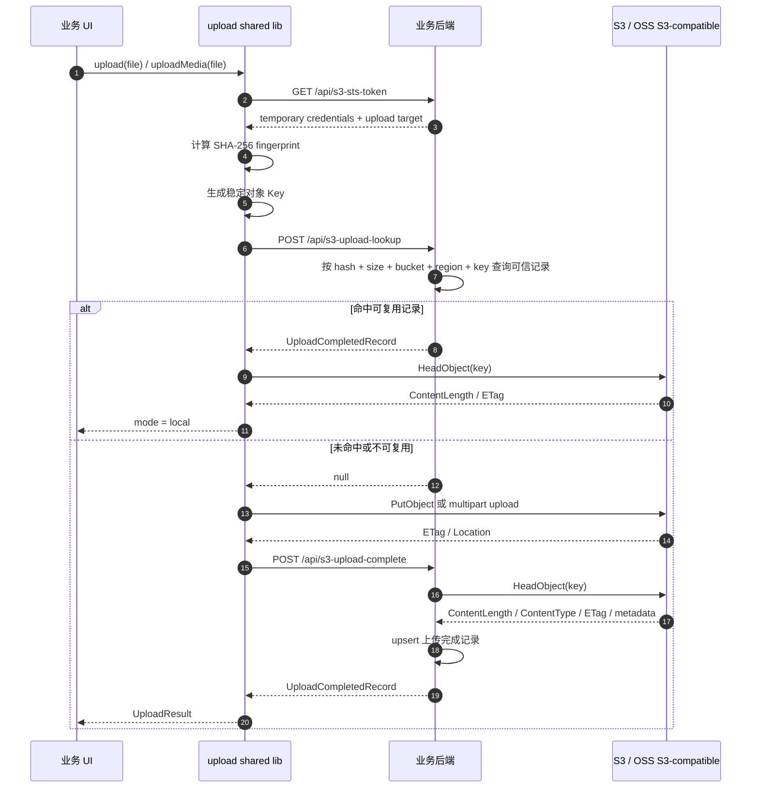
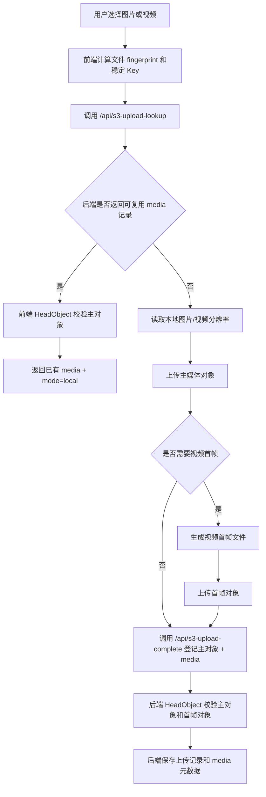

# S3 Upload 后端接口契约技术方案

## 1. 背景与目标

当前上传 shared lib 已经把断点续传和秒传改造为远端方案：

- 断点续传：前端通过稳定对象 Key 调用 `ListMultipartUploadsCommand` 和 `ListPartsCommand` 发现未完成 multipart upload。
- 秒传查询：前端通过 `/api/s3-upload-lookup` 向业务后端查询是否存在可复用的已完成对象。
- 本地 `checkpoint-store` 和 `completed-upload-store` 会被移除，不再把上传进度或秒传结果写入浏览器本地存储。

在这个前提下，业务后端只提供 `/api/s3-upload-lookup` 仍然不完整。合理的闭环应包含三个接口：

1. `/api/s3-sts-token`：签发浏览器直传对象存储所需的临时凭证和上传目标配置。
2. `/api/s3-upload-complete`：上传完成登记接口，保存文件指纹、对象 Key、对象存储信息和 media 元数据。
3. `/api/s3-upload-lookup`：秒传查询接口，基于后端可信上传记录判断是否允许复用。

该设计是合理的。三者职责不同：`/api/s3-sts-token` 解决“能否上传、上传到哪里”，`/api/s3-upload-complete` 解决“上传成功后如何进入业务记录”，`/api/s3-upload-lookup` 解决“下次是否可以复用已有业务记录”。如果没有完成登记接口，后端只能用 `bucket + key` 做无状态 `HeadObject` 判断，它可以确认对象存在，但无法确认对象是否属于当前业务流程、当前用户是否有权复用、media 元数据是否已入库、对象是否处于可用状态。

补充说明：当前前端在 `src/libs/upload/s3/object-operations.ts` 中已经通过 `HeadObjectCommand` 做对象校验，这个校验应该保留，用于防止 lookup 返回过期或错误记录。但它不能替代后端登记接口里的校验，因为浏览器侧校验不是业务可信边界，后端在入库前仍应自己调用 `HeadObject`。

## 2. 范围

包含：

- 明确三个后端接口的职责、请求体、响应体和校验规则。
- 定义前端可先落地的 TypeScript interface。
- 定义普通文件、媒体文件、视频首帧和秒传查询的前后端交互流程。
- 说明前端 `HeadObject` 与后端 `HeadObject` 的分工。

不包含：

- 不实现真实业务后端。
- 不改动对象存储 bucket policy、STS 服务或数据库 schema 的具体落地代码。
- 不恢复任何浏览器本地上传记录存储。

## 3. 业务流程

### 3.1 普通上传和秒传主流程



### 3.2 媒体上传流程

`uploadMedia(file)` 需要把现有 media 数据一并登记到业务后端。推荐流程是：先从本地 `File` 读取图片/视频分辨率并准备首帧文件；主媒体文件上传完成后，如果是视频且开启首帧上传，再上传首帧对象；最后一次性调用 `/api/s3-upload-complete` 登记主文件和 media 信息。



## 4. 模块设计

| 模块 | 设计职责 |
| --- | --- |
| `app/options.ts` | 应用默认入口绑定三个默认接口：`/api/s3-sts-token`、`/api/s3-upload-complete`、`/api/s3-upload-lookup` |
| `s3/upload-session.ts` | 请求并校验 upload session 响应 |
| `s3/completed-upload.ts` | 封装秒传查询和上传完成登记 fetcher |
| `core/uploader.ts` | 编排 lookup、上传、media 元数据读取、完成登记和最终结果返回 |
| `core/types.ts` | 暴露前后端交互需要的 TypeScript interface |
| `s3/object-operations.ts` | 前端通过 `HeadObjectCommand` 校验 lookup 命中的远端对象 |

## 5. 关键接口

### 5.1 通用响应结构

真实后端推荐统一使用标准响应包裹：

```ts
export interface ApiResponse<T> {
  code: number;
  message: string;
  data: T;
}
```

前端 fetcher 可以在开发阶段兼容 `{ code, message, data }` 和直接返回 `data` 两种格式，但真实接口建议统一返回 `ApiResponse<T>`。

### 5.2 `/api/s3-sts-token`

职责：签发浏览器直传对象存储所需的临时凭证和上传目标配置。

```ts
export interface TemporaryCredentials {
  securityToken: string;
  accessKeyId: string;
  accessKeySecret: string;
  expiresAt: string;
}

export interface UploadTargetConfig {
  bucket: string;
  region: string;
  endpoint?: string;
  basePath: string;
  publicBaseUrl?: string;
  forcePathStyle: boolean;
}

export interface UploadSessionResponse {
  credentials: TemporaryCredentials;
  upload: UploadTargetConfig;
}
```

推荐响应：

```ts
type UploadSessionApiResponse = ApiResponse<UploadSessionResponse>;
```

后端要求：

- 临时凭证只允许访问当前业务允许的 `bucket` 和 `basePath`。
- 如果允许前端调用 `ListMultipartUploads`，必须限制可列举的 prefix。
- `publicBaseUrl` 只表示读取域名配置，不代表该对象已经被业务登记。

### 5.3 `/api/s3-upload-lookup`

职责：判断当前文件是否已有可复用的已完成上传记录。

请求体：

```ts
export interface UploadCompletedLookupRequest {
  algorithm: 'sha256';
  hash: string;
  size: number;
  bucket: string;
  region: string;
  key: string;
  name: string;
  type: string;
  lastModified: number;
}
```

响应体：

```ts
export interface UploadedVideoFrameRecord {
  bucket: string;
  region: string;
  key: string;
  eTag?: string;
  publicUrl?: string;
  url?: string;
  urlKind?: 'public' | 'signed';
}

export interface UploadMediaMetadataRecord {
  type: 'image' | 'video';
  resolution: {
    width: number;
    height: number;
  };
  firstFrame?: UploadedVideoFrameRecord;
}

export interface UploadCompletedRecord {
  bucket: string;
  region: string;
  key: string;
  eTag?: string;
  location?: string;
  publicUrl?: string;
  media?: UploadMediaMetadataRecord;
}

type UploadCompletedLookupApiResponse = ApiResponse<UploadCompletedRecord | null>;
```

后端查询规则：

- 推荐以 `algorithm + hash + size + bucket + region + key` 查询业务上传记录。
- 未命中、无权限、记录不可复用、对象已删除或记录状态不可用时，返回 `data: null`。
- 命中后可按需再调用 `HeadObject` 验证对象仍存在，避免返回脏记录。
- 返回的 `publicUrl` 应由后端根据自身可信的 `publicBaseUrl` 或 CDN 配置生成，不应盲信前端传入的 URL。

### 5.4 `/api/s3-upload-complete`

职责：上传成功后登记业务上传记录，并返回后续 lookup 可复用的记录。

请求体：

```ts
export interface UploadCompletedReportInput {
  algorithm: 'sha256';
  hash: string;
  size: number;
  bucket: string;
  region: string;
  key: string;
  name: string;
  type: string;
  lastModified: number;
  eTag?: string;
  location?: string;
  media?: UploadMediaMetadataReport;
}

export interface UploadMediaMetadataReport {
  type: 'image' | 'video';
  resolution: {
    width: number;
    height: number;
  };
  firstFrame?: UploadedVideoFrameReport;
}

export interface UploadedVideoFrameReport {
  bucket: string;
  region: string;
  key: string;
  eTag?: string;
}
```

响应体：

```ts
type UploadCompletedReportApiResponse = ApiResponse<UploadCompletedRecord>;
```

后端登记规则：

- 接口必须是幂等的。相同 `algorithm + hash + size + bucket + region + key` 重复提交时，应返回同一条记录或更新必要 metadata。
- 后端必须调用 `HeadObject` 校验主对象存在，并校验 `ContentLength === size`。
- `ETag` 可以保存，但不能把它当成全量文件 MD5。multipart upload、服务端加密或兼容存储实现都会让 ETag 语义变化。
- 如果请求包含 `media.firstFrame`，后端也应对首帧对象调用 `HeadObject`，确认对象存在。
- `media.resolution` 当前由前端从浏览器 File 读取，后端可以作为业务元数据保存；如果未来用于审核、计费或强校验，应由后端异步解析媒体文件后再确认。
- 后端应保存稳定对象标识，而不是保存会过期的 `signedUrl`。推荐保存 `bucket`、`region`、`key`、`hash`、`size`、`type`、`media`、`status`、`ownerId`、`createdAt`、`updatedAt` 等字段。

## 6. 核心逻辑伪代码

### 6.1 前端上传编排

```ts
const session = await getUploadSession();
const identity = await createUploadIdentity(file, session.upload.basePath);
const preparedMedia = isMediaUpload
  ? await prepareMediaMetadata(file)
  : undefined;

const completed = await findCompletedUpload({
  ...identity,
  bucket: session.upload.bucket,
  region: session.upload.region,
  signal
});

if (completed && await headObjectSizeMatches(completed.key, file.size)) {
  return createLocalResult(completed);
}

const uploadResult = await uploadToObjectStorage(file, identity);

const media = preparedMedia
  ? await uploadFirstFrameIfNeeded(preparedMedia)
  : undefined;

const record = await reportCompletedUpload({
  ...identity,
  bucket: uploadResult.bucket,
  region: uploadResult.region,
  eTag: uploadResult.eTag,
  location: uploadResult.location,
  media
});

return mergeUploadResultWithRecord(uploadResult, record);
```

### 6.2 后端完成登记

```ts
async function completeUpload(input: UploadCompletedReportInput, user: CurrentUser) {
  assertUserCanWriteUploadRecord(user, input.bucket, input.region, input.key);
  assertKeyMatchesExpectedPrefix(input.key);

  const object = await s3.headObject({
    Bucket: input.bucket,
    Key: input.key
  });

  if (object.ContentLength !== input.size) {
    throw new Error('Uploaded object size mismatch.');
  }

  if (input.media?.firstFrame) {
    await s3.headObject({
      Bucket: input.media.firstFrame.bucket,
      Key: input.media.firstFrame.key
    });
  }

  return upsertCompletedUploadRecord({
    ...input,
    ownerId: user.id,
    status: 'available',
    publicUrl: createPublicUrl(input.key)
  });
}
```

### 6.3 后端秒传查询

```ts
async function lookupCompletedUpload(input: UploadCompletedLookupRequest, user: CurrentUser) {
  const record = await findRecord({
    algorithm: input.algorithm,
    hash: input.hash,
    size: input.size,
    bucket: input.bucket,
    region: input.region,
    key: input.key,
    status: 'available'
  });

  if (!record) return null;
  if (!userCanReuseRecord(user, record)) return null;

  const object = await s3.headObject({
    Bucket: record.bucket,
    Key: record.key
  });

  if (object.ContentLength !== record.size) return null;

  return toUploadCompletedRecord(record);
}
```

## 7. 风险评估

- State management risk：前端只影响 upload shared lib 的编排状态，不引入 React Query key 或全局状态。
- Breaking change risk：新增 `/api/s3-upload-complete` 和 `reportCompletedUpload` 属于上传 shared lib 的新契约；默认启用后，调用方需要能 mock 或提供真实接口。
- Idempotency risk：上传完成后前端可能重试登记，后端必须 upsert，不能重复创建多条冲突记录。
- Consistency risk：如果上传成功但完成登记失败，短时间内 lookup 查不到记录。可以通过前端重试和 S3 Event Notifications 异步补偿降低影响。
- Security risk：前端 `HeadObject` 只能作为体验侧防御，后端仍必须做权限校验、prefix 校验和 `HeadObject` 校验。
- Media metadata risk：前端读取的分辨率适合作为展示元数据；如果后续用于强审核，应由后端异步解析确认。
- ETag risk：不能把 `ETag` 当成稳定内容 hash，文件唯一性仍以 `sha256 + size` 为准。

## 8. 验证计划

- 前端类型层面新增 `UploadCompletedReportInput`、`UploadCompletedReporter`、`completedUploadReportUrl` 等契约。
- 默认应用入口应绑定三个接口：`/api/s3-sts-token`、`/api/s3-upload-complete`、`/api/s3-upload-lookup`。
- 普通上传成功后调用完成登记接口。
- `uploadMedia` 应在 media 元数据和视频首帧上传完成后登记，避免登记缺失 `media`。
- lookup 命中后仍执行前端 `HeadObject` 校验对象大小。
- 完成登记接口失败时需要明确策略：推荐抛错，让业务知道“文件已传到对象存储，但业务登记失败”；如果要降级为上传成功但未登记，应由业务层显式决定。
