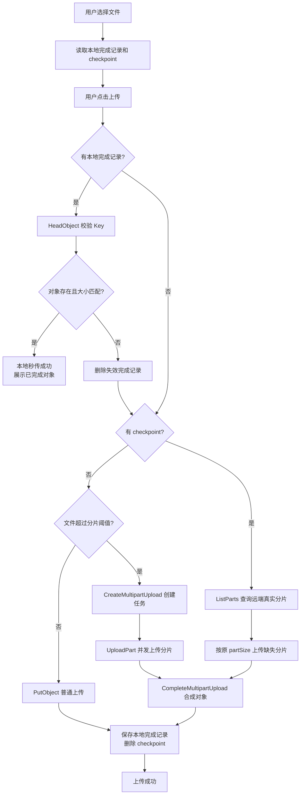

# @oss-test/s3-multipart-upload

基于 S3 协议的浏览器端断点续传上传示例。设计参考掘金文章《文件上传-基于S3协议的通用对象存储方案》，但实现上统一采用 AWS SDK v3 的底层 S3 multipart API。

## 设计取舍

- 开发环境使用 OSS S3-compatible endpoint 模拟 S3。
- 生产环境继续使用 AWS SDK v3；`VITE_S3_ENDPOINT` 留空时走 AWS S3 默认 endpoint。
- `/api/s3-sts-token` 只返回 `securityToken`、`accessKeyId`、`accessKeySecret` 三个字段。
- `bucket`、`region`、`basePath`、`endpoint`、分片大小和并发数均由前端环境变量控制。
- 断点续传不使用 `@aws-sdk/lib-storage Upload`，因为它没有公开可持久化 checkpoint/resume API；这里的 checkpoint 只保存 `UploadId`、`Key`、`partSize` 和文件标识，恢复时通过 `ListParts` 查询远端真实分片状态。

## 关键能力

- 小文件走 `PutObjectCommand`。
- 大文件走 `CreateMultipartUploadCommand`、`UploadPartCommand`、`ListPartsCommand`、`CompleteMultipartUploadCommand`。
- 使用 `p-limit` 控制分片并发。
- 暂停上传时保留本地 checkpoint，恢复时复用原 `UploadId`。
- 终止上传时调用 `AbortMultipartUploadCommand` 并清理本地 checkpoint。
- 完成后可用 `GetObjectCommand` 生成预签名读取 URL。
- 上传完成后保存同浏览器本地完成记录；再次点击上传时先用 `HeadObjectCommand` 校验远端对象，命中后直接复用。

## 统一上传流程

选择文件只会加载本地候选信息，不会立刻上传，也不会立刻展示秒传结果。用户点击“上传”后，前端按固定顺序自动选择最合适的路径：先尝试本地完成记录复用，再尝试断点续传，最后才创建新上传任务。



“重新上传”会跳过本地完成记录和 checkpoint，强制创建新的对象 Key 和上传任务。

## 环境变量

本子包已提供实际读取的 `.env` 文件，同时保留 `.env.example` 作为提交到仓库的示例模板。至少需要配置：

```bash
VITE_S3_BUCKET=your-bucket
VITE_S3_REGION=oss-cn-hangzhou
VITE_S3_ENDPOINT=https://s3.oss-cn-hangzhou.aliyuncs.com
```

生产 AWS S3 可以把 `VITE_S3_ENDPOINT` 留空：

```bash
VITE_S3_ENDPOINT=
```

## 后端接口

子包默认请求：

```http
GET /api/s3-sts-token
```

成功响应只包含三个字段：

```json
{
  "securityToken": "...",
  "accessKeyId": "...",
  "accessKeySecret": "..."
}
```

该接口已在 `apps/api` 中新增，沿用现有 `OSS_ACCESS_KEY_ID`、`OSS_ACCESS_KEY_SECRET`、`ROLE_ARN` 环境变量。

## 启动

```bash
pnpm install
pnpm dev:api
pnpm dev:s3-multipart-upload
```

前端默认端口是 `5176`，并通过 Vite proxy 把 `/api` 转发到 `http://localhost:3000`。

## 存储侧要求

Bucket CORS 需要允许浏览器发起 multipart 相关请求，至少覆盖 `PUT`、`GET`、`POST`、`DELETE`、`OPTIONS`，并允许 SDK 签名所需请求头。

RAM/STS 权限需要覆盖：

- `oss:PutObject`
- `oss:InitiateMultipartUpload`
- `oss:UploadPart`
- `oss:ListParts`
- `oss:CompleteMultipartUpload`
- `oss:AbortMultipartUpload`
- `oss:GetObject`（用于 `GetObjectCommand` 预签名读取，也用于 `HeadObjectCommand` 校验本地完成记录）

## 参考

- 掘金文章：<https://juejin.cn/post/7413557963313397795>
- AWS S3 multipart upload overview：<https://docs.aws.amazon.com/AmazonS3/latest/userguide/mpuoverview.html>
- Alibaba Cloud OSS 使用 Amazon S3 SDK 访问 OSS：<https://www.alibabacloud.com/help/en/oss/developer-reference/use-amazon-s3-sdks-to-access-oss>
