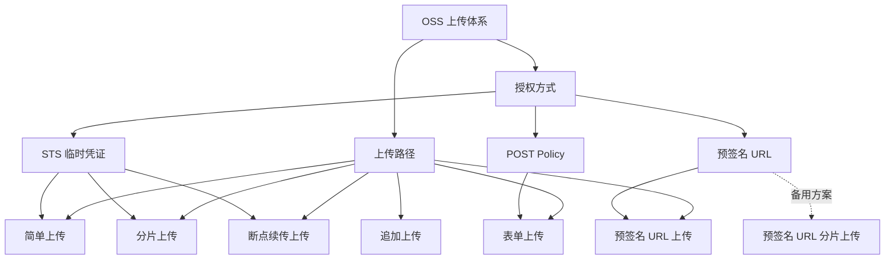
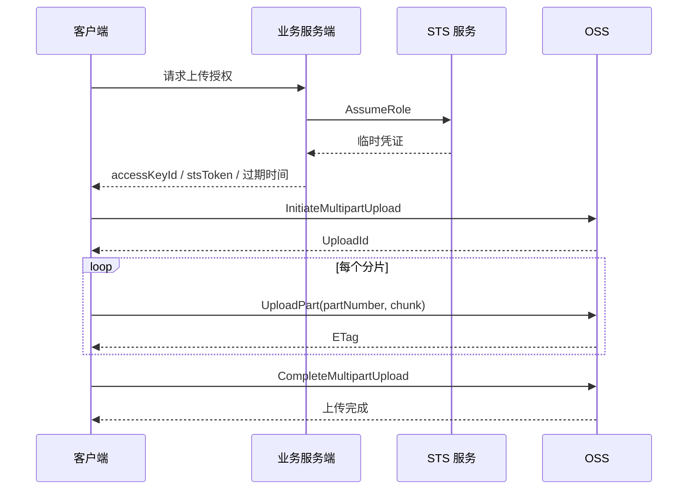
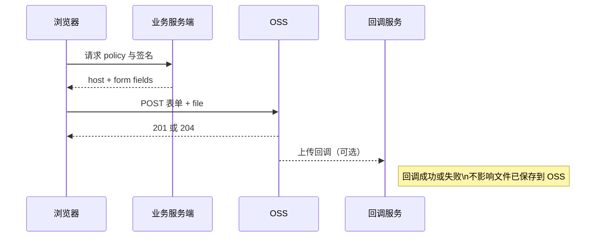
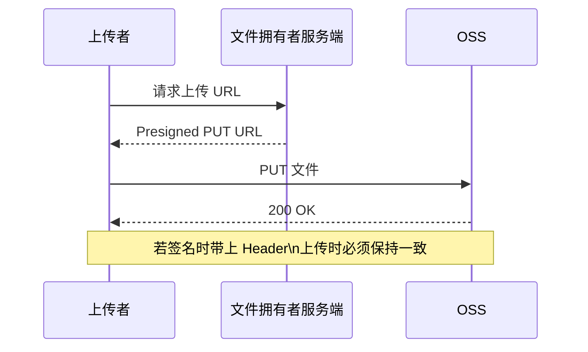
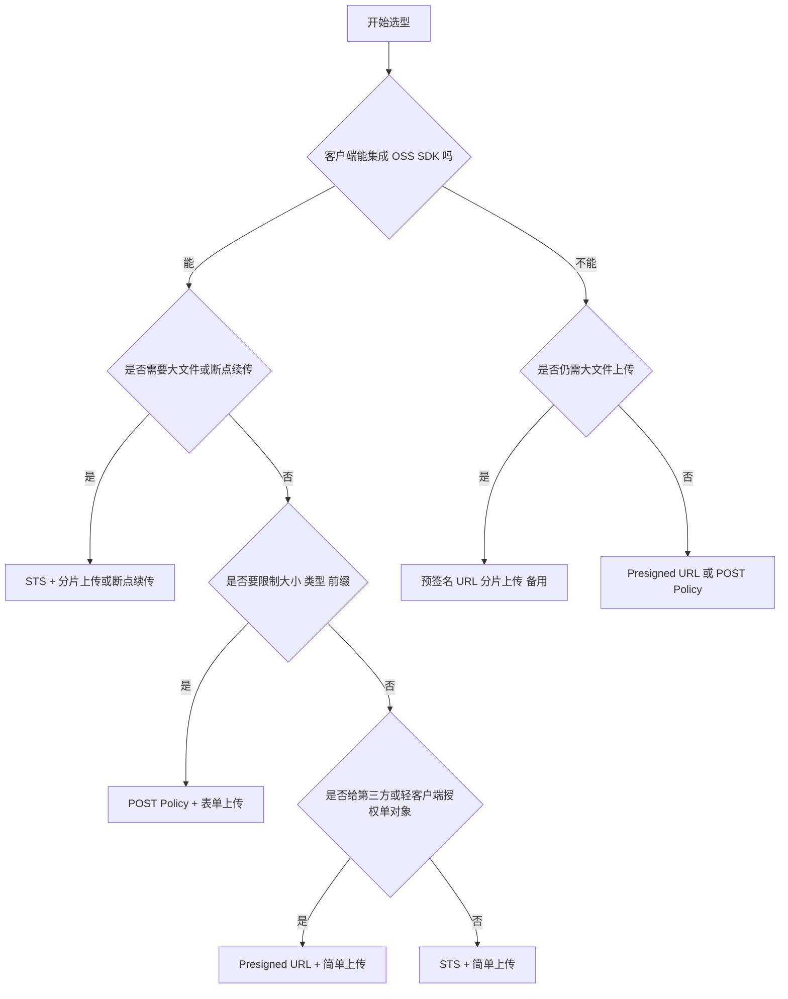

# 阿里云 OSS 上传选型指南：如何在 STS、POST Policy 与预签名 URL 之间做选择

副标题：从简单上传到分片直传，把常见方案一次讲清楚

在 OSS 上传这件事上，很多团队一开始就把问题问反了。真正该先问的不是“我要不要用预签名 URL”，而是：**文件准备怎么进 OSS，客户端又凭什么有权限把它传进去**。

如果先说结论，这篇文章可以浓缩成三句话：

1. **在条件允许时，优先客户端直传 OSS，而不是让业务服务器中转文件。** 这样可以避免同一份数据在网络里走两遍，通常也更省服务器资源。
2. **大部分上传场景，优先选 STS 临时访问凭证。** 尤其是需要大文件、分片上传、断点续传、上传进度时，`STS + OSS SDK` 通常是默认首选。
3. **如果你最关心“约束上传条件”，选 POST Policy；如果你只想给某个对象发一个临时上传许可，选预签名 URL。**

这篇文章会按下面的顺序讲清楚：

- 先分清楚“上传路径”和“授权方式”是两回事
- 再把 OSS 常见上传路径逐个讲清楚
- 然后回答 STS、POST Policy、预签名 URL 到底怎么选
- 最后落到具体业务场景和工程边界上

---

## 一、先建立心智模型：上传路径和授权方式不是一回事

先把两个概念拆开：

- **上传路径**：解决“文件怎么进 OSS”
- **授权方式**：解决“客户端凭什么能上传”

很多讨论之所以越来越乱，就是因为把这两层混成了一层。

### 1. 上传路径：文件进入 OSS 的方式

常见上传路径包括：

- 简单上传
- 分片上传
- 断点续传上传
- 表单上传
- 预签名 URL 上传
- 追加上传

另外还有一个需要单独说明的特例：

- **预签名 URL 分片上传**：它不是默认路径，而是客户端不能集成 OSS SDK 时的大文件备用方案

### 2. 授权方式：客户端拿什么权限上传

常见授权方式主要有三类：

- **STS 临时访问凭证**
- **POST Policy**
- **预签名 URL**

它们和上传路径的关系不是“一一并列”，而是组合关系：

- **STS** 可以覆盖简单上传、分片上传、断点续传上传
- **POST Policy** 主要对应表单上传
- **预签名 URL** 通常对应简单上传；在客户端无法集成 SDK 时，也可以扩展成更复杂的“预签名 URL 分片上传”备用方案

下面这张图可以先把全局关系看明白。



这张图最重要的意义只有一个：**不要把 STS、POST Policy、预签名 URL 和“分片上传”“表单上传”当成同一层的概念。** 前者是授权，后者是上传路径。

---

## 二、先讲上传路径：OSS 的主要上传方式分别适合什么场景

### 1. 简单上传：实现成本最低的基础路径

简单上传本质上就是一次 `PutObject` 请求上传一个对象。

它适合的场景很明确：

- 单个文件不超过 **5 GB**
- 不追求按分片并发提速
- 不需要复杂的失败恢复机制
- 更看重实现简单、链路短

所以你可以把它理解成：**最基础、最直接、最省理解成本的上传路径**。

如果只是后台上传图片、PDF、合同、普通附件，而且单个文件体积不大，简单上传通常足够。

但它的边界也很明确：

- 没有分片并发这类能力
- 对大文件不友好
- 上传过程中一旦失败，往往要重传整个文件

### 2. 分片上传：大文件的标准路径

分片上传的核心流程是三步：

1. `InitiateMultipartUpload`：初始化上传任务，拿到 `UploadId`
2. `UploadPart`：逐个上传分片
3. `CompleteMultipartUpload`：通知 OSS 合并分片

它适合的场景也非常典型：

- 文件很大
- 希望并发上传以提高速度
- 某个分片失败时，只重传该分片
- 需要更稳妥的错误恢复能力

关键边界通常包括：

- 单文件最大约 **48.8 TB**
- 分片数量范围 **1 ~ 10,000**
- 单个分片大小 **100 KB ~ 5 GB**
- **最后一个分片**可以小于 100 KB

所以，凡是你看到“大视频”“安装包”“数据归档”“大模型文件”“长时录音原件”这类关键词，第一反应通常都应该先想到分片上传。

下面这张图可以把典型的 `STS + 分片上传` 链路具象化。



这条链路也是为什么很多工程团队最终都会把默认方案落在 **`STS + OSS SDK`** 上：它天然能覆盖大文件、进度、并发、重试这些需求。

### 3. 断点续传上传：本质上是 SDK 对分片上传的封装

断点续传上传经常会被误解成一种“完全独立”的上传方式。更准确地说，它是 **SDK 基于分片上传做的封装能力**。

它适合的问题是：

- 网络不稳定
- 上传过程中浏览器、进程或程序可能异常退出
- 希望下次继续上传时从断点恢复，而不是全部重来

它的核心依赖是本地 **Checkpoint**。SDK 会把上传状态记录到本地，用于恢复任务。

这也意味着它有几条必须接受的前提：

- 客户端必须对 Checkpoint 文件或本地状态有写入能力
- Checkpoint 损坏时，可能无法恢复
- 本地文件发生变化时，可能触发重新上传全部分片

所以不要把“断点续传”理解成绝对不丢进度。更准确的说法是：**在本地状态可持续、文件未变化、Checkpoint 完整的前提下，SDK 可以从断点继续上传。**

### 4. 表单上传：适合受控的浏览器表单场景

表单上传是浏览器通过标准 HTML 表单，以 `HTTP POST` 直接把文件传到 OSS。

它的特点非常鲜明：

- 非常适合标准 Web 表单场景
- 服务端可以通过签名和 Policy 约束上传条件
- 对前端来说实现门槛低

但它的能力边界也同样鲜明：

- 对象大小不能超过 **5 GB**
- **不支持基于分片的大文件上传**
- **不支持分片断点续传**

换句话说，表单上传的优势从来不是“万能”，而是：

> 你需要一个浏览器标准表单直传链路，并且希望服务端能限制文件大小、类型、目录前缀等属性。

如果你的诉求已经变成了大文件、断点续传、复杂失败恢复，那就不该继续拿表单上传硬扛。

下面这张图适合帮助理解它的定位。



### 5. 预签名 URL 上传：给某个对象发一个有时效的上传许可

预签名 URL 上传的思路和发临时凭证不一样。

这里不是把一段“能自行签名的权限”交给客户端，而是服务端先为某个请求签好名，然后把一个**有时效的 PUT 上传 URL**交给上传者。上传者不需要拿到 AccessKey，也不需要自己计算签名。

它非常适合：

- 给第三方授权上传
- 给轻客户端授权上传
- 只想开放一个特定对象的临时上传入口

但这条路径有几个特别容易说错的限制：

- 它默认更适合**简单上传**
- **不支持 `FormData`**
- SDK 生成的预签名 URL 最长有效期通常为 **7 天**
- 如果 URL 是基于 STS Token 生成，最长有效期受临时凭证约束，通常不超过 **12 小时**
- URL 在有效期内可以被多次访问，若对象键相同，存在重复上传覆盖风险

还要特别注意一个工程细节：

> 如果生成 URL 时把 `Content-Type` 等 Header 也签进去了，实际上传请求必须带上完全一致的 Header。浏览器自动补的 Header 也可能导致签名不匹配，最终返回 403。

下面这张时序图很适合拿来给团队解释它的本质。



### 6. 预签名 URL 分片上传：不是不能做，但应当视为备用方案

这里最值得澄清的误区是：

- 错误说法：**预签名 URL 完全不能做分片上传**
- 更准确的说法：**普通的预签名 PUT URL 并不适合分片和断点续传，但 OSS 文档确实提供了“预签名 URL 分片上传”的备用方案**

这个方案的典型使用前提是：

- 客户端**不能集成 OSS SDK**
- 但业务上又必须支持大文件上传

它的复杂度明显高于 `STS + SDK`，因为服务端需要承担更多工作：

- 初始化 `UploadId`
- 为每个分片生成对应 URL
- 记录 `UploadId`
- 保证 `partNumber` 和文件分片严格一一对应
- 在全部上传后执行校验与合并

也就是说，这条路径不是“更先进”，而是“在受限前提下的替代方案”。如果客户端能集成 OSS SDK，通常还是更推荐 STS。

### 7. 追加上传：让同一个对象持续增长，而不是反复覆盖

追加上传的定位非常特殊，它不是常规意义上的“上传文件”，而是：

> 持续向同一个对象的末尾追加数据。

典型场景是：

- 实时视频流
- 连续写入日志流
- 分段生成、但逻辑上属于同一对象的数据流

这条路径的关键边界包括：

- 生成的是 **Appendable** 类型对象
- 对象总大小不能超过 **5 GB**
- 不支持冷归档、深度冷归档对象的追加上传
- **不支持上传回调**
- 如果对象已存在但不是追加类型，会返回 `ObjectNotAppendable`
- 如果追加位置不等于当前对象长度，会返回 `PositionNotEqualToLength`

还要特别保守地理解两件事：

1. **OSS 对象类型之间不支持互相转换。** `Normal`、`Multipart`、`Appendable` 不是可自由切换的。已有普通对象不能直接“变成 appendable 再继续追加”。
2. **追加上传不应被理解成通用文件合并方案。** 特别是视频文件，字节能追加，不代表播放器元数据会自动适配成一个自然可播放的“合并视频”。

---

## 三、再讲授权方式：STS、POST Policy、预签名 URL 到底怎么选

先给一个可以直接拿去内部沟通的对比表。

| 方案 | 默认推荐度 | 适合的客户端 | 是否支持大文件/分片 | 是否能限制文件属性 | 是否适合第三方上传 | 服务端参与深度 | 主要风险或约束 |
| --- | --- | --- | --- | --- | --- | --- | --- |
| STS 临时凭证 | 高 | 可集成 OSS SDK 的 Web、App、服务端程序 | 是 | 可以通过权限策略限制范围，但不以表单属性控制见长 | 一般不作为最轻量第三方授权 | 中等 | 需要缓存和刷新凭证，策略不能放太宽 |
| POST Policy | 中 | 浏览器表单上传 | 否 | 是，适合限制大小、类型、前缀 | 一般 | 中等 | 不适合大文件，不支持分片断点续传 |
| 预签名 URL | 中 | 轻客户端、第三方上传者 | 默认不适合；仅简单上传最自然 | 不以复杂属性约束见长 | 是 | 较低到中等 | Header 必须一致，URL 有效期内可多次访问，存在覆盖风险 |

### 1. 为什么说 STS 是大部分上传场景的默认首选

如果你的客户端能集成 OSS SDK，那么 STS 往往是最稳妥的默认方案。

原因并不神秘：

- 客户端拿到的是**临时访问凭证**，可以在有效期内自行生成签名
- 这让客户端天然适合调用 OSS SDK 的能力
- 也就更容易覆盖简单上传、分片上传、断点续传、上传进度等需求

对于真正的工程系统来说，这个组合通常比“服务端给每个动作都签一次名”更自然。

### 2. STS 的工程要求：不是发出去就完了

STS 虽然常常是默认首选，但它不是“甩给前端一把万能钥匙”。

工程上至少要守住这几条：

- **临时凭证要短期有效**，不要发长期可用权限
- **客户端要缓存凭证并在过期前刷新**，避免每次操作都去请求 STS
- **不要高频调用 STS**，否则可能带来限流问题
- **权限策略尽量收缩**，例如只允许写入指定前缀，只允许必要动作

下面这段客户端代码，正好能说明为什么 `STS + SDK` 常常是默认首选：它用很少的代码，就覆盖了大文件、分片和上传进度。

### 示例 1：`STS + OSS SDK` 直传大文件

```ts
import OSS from 'ali-oss'

const creds = await fetch('/api/oss/sts').then(r => r.json())
const client = new OSS({
  region: creds.region,
  bucket: creds.bucket,
  accessKeyId: creds.accessKeyId,
  accessKeySecret: creds.accessKeySecret,
  stsToken: creds.stsToken,
})

await client.multipartUpload(`user/${userId}/${file.name}`, file, {
  progress: (p) => updateProgress(Math.round(p * 100)),
})
```

这段代码想表达的重点不是 SDK 语法，而是：

- **能集成 OSS SDK 时，STS 可以直接覆盖上传进度、大文件、分片上传**
- 小文件时可以改用 `put`
- 大文件时优先 `multipartUpload`

服务端的职责也应该尽量简单清晰：负责签发短期、收敛权限的临时凭证，而不是代替客户端搬运文件。

### 示例 2：Node.js 服务端签发 `STS` 临时凭证的伪代码

```ts
app.get('/api/oss/sts', async (req, res) => {
  const creds = await assumeRole({
    roleArn: process.env.OSS_ROLE_ARN,
    durationSeconds: 3600,
    policy: allowPrefix(`user-uploads/${req.user.id}/*`),
  })

  res.json({
    region: process.env.OSS_REGION,
    bucket: process.env.OSS_BUCKET,
    ...creds,
  })
})
```

这只是伪代码，但它体现了两个比 SDK 细节更重要的原则：

- 临时凭证要**短期有效**
- 权限要尽量**收敛到指定前缀**

### 3. POST Policy：当你最关心“约束上传条件”时

如果你的重点不是大文件，而是：

- 文件大小必须受控
- 文件类型必须受控
- 上传目录前缀必须受控
- 前端最好就是标准表单上传

那 POST Policy 通常是很合适的。

它的强项不是“通用能力最强”，而是：**能把上传约束显式放进服务端控制的策略里。**

### 示例 3：`POST Policy + 表单上传`

```ts
const policy = await fetch('/api/oss/post-policy').then(r => r.json())

const form = new FormData()
for (const [key, value] of Object.entries(policy.fields)) {
  form.append(key, value)
}
form.append('file', file)

await fetch(policy.host, {
  method: 'POST',
  body: form,
})
```

这条路径特别适合：

- 官网表单收件
- 活动页报名资料上传
- 轻量级文件提交流程
- 需要服务端明确限制文件条件的浏览器上传

但边界也要讲死：

- 它**不是大文件方案**
- 它**不是断点续传方案**
- 它不该被当成“所有 Web 上传都先用这个”的默认答案

### 4. 预签名 URL：当你不想发凭证，只想发一个临时上传许可

预签名 URL 的最佳使用语境通常是：

- 你不想把任何凭证能力交给上传者
- 你只想允许对某个对象做一次或一段时间内的上传
- 上传者可能是第三方、外包、合作方或功能非常轻的客户端

### 示例 4：`Presigned URL` 简单上传

```ts
const { url, headers } = await fetch('/api/oss/presigned-put?name=' + encodeURIComponent(file.name))
  .then(r => r.json())

await fetch(url, {
  method: 'PUT',
  headers,
  body: file,
})
```

有两条实践提醒特别重要：

- **不要把文件包进 `FormData`**，这不是表单上传
- 如果生成 URL 时签入了 `Content-Type` 或其他 Header，实际上传时必须原样带上

这条路径不是不能扩展，但一旦扩展到分片、多阶段状态管理、服务端记录 `UploadId`，复杂度就会明显上升。因此它最自然的位置仍然是：**简单上传的临时授权方案。**

### 5. 客户端不能集成 SDK 时怎么办

这时才该认真考虑“预签名 URL 分片上传”这个备用方案。

### 示例 5：`预签名 URL 分片上传` 备用方案

```ts
const init = await fetch('/api/oss/multipart/init', {
  method: 'POST',
  body: JSON.stringify({ name: file.name, size: file.size }),
}).then(r => r.json())

for (const part of init.parts) {
  const chunk = file.slice(part.start, part.end)
  await fetch(part.url, { method: 'PUT', body: chunk })
}

await fetch('/api/oss/multipart/complete', {
  method: 'POST',
  body: JSON.stringify({ uploadId: init.uploadId, objectKey: init.objectKey }),
})
```

这段代码只是说明结构，不是在暗示“它和 STS 一样简单”。

真正的重点是：

- 这只是**备用方案**
- 服务端仍需负责 `UploadId`
- 需要为每个分片生成 URL
- `partNumber` 和文件分片要严格一一对应
- 还需要最终校验与合并

如果客户端能集成 OSS SDK，通常没有必要把自己带到这条更复杂的路上。

---

## 四、怎么把选择落到场景里

如果只讲能力列表，文章看完仍然很难做决策。真正有用的是：**按业务场景选，而不是按名词热度选。**

### 场景 1：企业后台上传图片、PDF、普通附件

典型特点：

- 上传者是受控用户
- 前端页面可定制
- 文件体积通常差异较大

推荐方案：

- **默认用 STS**
- 小文件可直接简单上传
- 超过阈值切到分片上传

为什么这样选：

- 同一套授权方式能覆盖从小文件到大文件
- 后续要加进度条、失败重试、并发上传都更自然

不建议：

- 一上来就全部走 POST Policy
- 明明是内部系统，还为每个文件单独签预签名 URL，导致服务端交互过重

### 场景 2：上传大视频、安装包、数据归档，网络还容易抖动

典型特点：

- 文件大
- 上传时间长
- 中断概率高

推荐方案：

- **STS + 断点续传上传**
- 本质上依赖分片上传能力

为什么这样选：

- 可以从断点继续
- 某个分片失败时不必全部重传
- 更容易做进度和恢复体验

不建议：

- 继续拿简单上传硬传
- 指望表单上传解决大文件和断点续传

### 场景 3：活动页、报名页、官网表单收文件，而且服务端必须限制大小和类型

典型特点：

- 浏览器表单语义明显
- 业务更关注“约束”，而不是大文件能力

推荐方案：

- **POST Policy + 表单上传**

为什么这样选：

- 可以通过策略限制大小、类型、目录前缀等属性
- 很适合标准表单链路

不建议：

- 用这条路径承载大文件
- 把它描述成支持断点续传的通用上传方案

### 场景 4：合作方、第三方、外包或临时客户端，只需要上传一个指定对象

典型特点：

- 你不想把凭证能力交给对方
- 只想开放一个短期上传入口

推荐方案：

- **预签名 URL + 简单上传**

为什么这样选：

- 上传者无需拿到密钥
- 授权边界清晰
- 适合短期、单对象、低耦合授权

不建议：

- 为这种场景发 STS 全能力临时凭证
- 忘记处理 URL 有效期和覆盖风险

### 场景 5：客户端无法集成 OSS SDK，但业务上必须上传大文件

典型特点：

- 受限运行环境
- 仍需处理大文件

推荐方案：

- **预签名 URL 分片上传，作为备用方案**

为什么这样选：

- 它确实能覆盖大文件分片
- 但复杂度明显更高，应在受限前提下使用

不建议：

- 把它当成 STS 的等价替代
- 忽略服务端对分片 URL、UploadId、最终合并的管理成本

### 场景 6：数据会持续长到同一个对象末尾

典型特点：

- 你想维护的是一个“持续增长的对象”
- 不是反复覆盖，也不是上传后再拼接

推荐方案：

- **追加上传**

为什么这样选：

- 它就是为“向同一对象末尾持续追加数据”设计的

不建议：

- 把它当成通用文件合并工具
- 认为任何现有对象都能直接转成 `Appendable`

---

## 五、STS、POST Policy、预签名 URL 怎么快速决策

如果你需要一个能截图传播的判断图，可以直接用下面这张。



如果只想记一句话，那就是：

- **能用 SDK 时，优先 STS**
- **要控表单属性时，优先 POST Policy**
- **要给外部发单对象临时上传许可时，优先预签名 URL**
- **大文件又不能集成 SDK 时，再考虑预签名 URL 分片上传**

---

## 六、工程落地必须单独讲的七个边界

真正让上传方案出问题的，往往不是“选错名词”，而是忽略边界。

### 1. CORS 是 Web 端和小程序直传的前置条件

只要是浏览器或小程序直接上传 OSS，跨域就是前置问题。

演示环境里，你可能会为了先跑通，临时把 Bucket 的允许来源写成 `*`。但生产环境不该长期这样配置，更稳妥的做法是把允许来源收紧到业务系统的具体地址。

这不是“安全锦上添花”，而是 Web 直传方案的基础配置。

### 2. 上传进度：优先在 OSS SDK 能力下讨论

工程里经常会问：“这个方案有没有官方进度条？”

更保守的说法是：**OSS 文档明确展示了 SDK 的进度监听/回调能力。** 如果你需要稳定可发布的上传进度体验，最自然的实现路径通常还是 SDK 驱动的上传链路。

所以不要轻易把“进度能力”泛化成所有浏览器直传路径都拥有同一种官方机制。

### 3. 上传回调：支持范围有限，而且回调失败不影响文件已上传

如果你需要上传完成后通知业务服务器继续做转码、审核、入库、异步处理，那么要先确认当前路径是否支持回调。

常见支持回调的操作主要是：

- `PutObject`
- `PostObject`
- `CompleteMultipartUpload`

也就是说，常见对应关系大致是：

- 简单上传：可支持回调
- 表单上传：可支持回调
- 分片上传：在**完成合并**时可支持回调
- 追加上传：**不支持回调**

还要特别记住一句容易被说错的话：

> 回调成功或失败，不影响文件已经上传并保存到 OSS。

回调失败不等于文件没传上去。

### 4. 同名覆盖风险：默认就存在，必须主动治理

无论是表单上传、简单上传还是预签名 URL 上传，只要对象键相同，通常就存在被覆盖的风险。

常见治理思路有两类：

- **开启版本控制**
- 在上传请求里带上 `x-oss-forbid-overwrite=true`

下面这段代码足够把这个保护点讲清楚。

### 示例 6：覆盖保护提示片段

```ts
await fetch(url, {
  method: 'PUT',
  headers: {
    ...headers,
    'x-oss-forbid-overwrite': 'true',
  },
  body: file,
})
```

如果这个 Header 被签入了预签名 URL，那么上传请求就必须保持一致，否则也可能导致签名不匹配。

### 5. 分片清理：未完成任务不会自动“白白消失”

分片上传还有一个经常被忽略的成本边界：

- 如果上传意外中断
- 且没有执行 `AbortMultipartUpload`
- 已上传的分片会作为碎片保留
- 并且会持续产生存储费用

所以不能把未完成分片写成“会自动过期而且不收费”。常见清理方式包括：

- 控制台清理
- 生命周期规则清理
- `ossutil` 清理
- SDK 主动清理

分片上传任务本身没有一个你可以默认依赖的“自动无害过期”机制。

### 6. 预签名 URL 的 Header 一致性不能忽略

这是生产环境里非常常见的坑。

如果你在生成预签名 URL 时把某些 Header 一起签名了，比如：

- `Content-Type`
- 自定义 Header
- 覆盖保护相关 Header

那么上传请求必须带上一致的值。否则即便 URL 看起来没过期，也可能因为签名不匹配而失败。

尤其在浏览器环境里，自动补齐的 `Content-Type` 都可能成为问题来源，所以这条规则一定要写进实现规范。

### 7. 追加上传的真实边界：它不是通用合并能力

最后再单独强调一次追加上传。

请把它理解成：

- 面向“同一对象持续增长”的专用能力
- 不是已有对象类型之间的转换机制
- 也不是把多个媒体文件自然拼成一个可播放文件的通用方案

如果你的业务本质是多文件拼接、媒体重新封装、内容级合并，那么问题通常已经超出“OSS 上传方式”的范畴了。

---

## 七、把结论收成一张可执行的决策清单

当你要为一个新业务选 OSS 上传方案时，按顺序问自己这五个问题：

1. **客户端能不能集成 OSS SDK？**
2. **文件会不会很大？**
3. **网络是否不稳定，需要断点恢复？**
4. **是否必须由服务端限制大小、类型、目录前缀等属性？**
5. **是不是只是给第三方一个临时上传某个对象的许可？**

顺着这五个问题，大多数场景都会落到比较稳定的答案：

- 能用 SDK 时，优先 **STS**
- 要控表单属性时，选 **POST Policy**
- 要对外发单对象上传许可时，选 **预签名 URL**
- 大文件又不能集成 SDK 时，再考虑 **预签名 URL 分片上传** 这个备用方案
- 需要让同一对象持续增长时，才考虑 **追加上传**

如果只想让团队记住三条，就记这三句：

1. **大多数场景选 STS**
2. **受控表单选 POST Policy**
3. **临时单对象授权选预签名 URL**

这三条记住了，OSS 上传选型里最容易走偏的地方，已经避开大半。

---

## 参考资料

- [在客户端直接上传文件到OSS](docs/在客户端直接上传文件到OSS.md)
- [上传文件到OSS的多种方式](docs/上传文件到OSS的多种方式.md)
- [概述](docs/概述.md)
- [简单上传](docs/简单上传.md)
- [分片上传](docs/分片上传.md)
- [断点续传上传](docs/断点续传上传.md)
- [表单上传](docs/表单上传.md)
- [使用预签名URL上传文件](docs/使用预签名URL上传文件.md)
- [服务端签名直传](docs/服务端签名直传.md)
- [上传回调](docs/上传回调.md)
- [上传OSS文件时获取上传进度](docs/上传OSS文件时获取上传进度.md)
- [追加上传](docs/追加上传.md)
