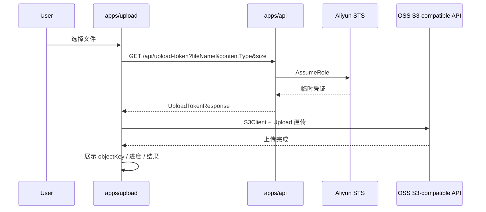

# 详细设计：OSS / AWS S3 前端直传统一上传

## 1. 文档说明

本文档基于根目录 `技术方案.md` 编写，用于指导当前 monorepo 新增一套基于 AWS SDK v3 的统一上传示例。

当前阶段的优先目标是：在本项目内跑通前后端对接流程。

- 开发环境：后端签发阿里云 OSS 临时凭证，并返回 OSS S3-compatible endpoint。
- 前端：统一使用 `@aws-sdk/client-s3` 和 `@aws-sdk/lib-storage` 上传文件。
- 生产兼容方向：后端未来可切换为 AWS STS / AssumeRole，前端上传代码不变。

## 2. 设计目标

1. 新增 `apps/upload`，作为主上传方案示例。
2. 新增 `GET /api/upload-token`，为前端返回统一上传令牌。
3. 统一使用现有 API 响应包装：`{ success, data, message, error }`。
4. 后端直接返回完整 `objectKey`，前端不再自行决定对象路径。
5. 前端通过 AWS SDK v3 初始化 `S3Client`，通过 `Upload` 执行简单上传或 multipart 上传。
6. 上传完成后，前端展示上传结果，并以 `objectKey` 作为后续业务保存的主标识。
7. 刷新后断点续传能力写入扩展设计，但不阻塞当前项目跑通主链路。

## 3. 非目标

1. 不把 `ali-oss` 作为主上传链路。
2. 不在前端暴露长期 AccessKey / SecretKey。
3. 不让前端通过 `bucket + endpoint + key` 盲拼最终公网访问地址。
4. 不在当前阶段完整实现生产 AWS 后端。本文只定义生产 AWS 需要满足的同一份上传令牌契约。
5. 不把 multipart 的 ETag 形态作为跨云一致的成功判断依据。

## 4. 当前仓库改造范围

```text
monorepo
├── apps/
│   ├── api/           # 需要新增统一上传 token 接口
│   ├── web/           # 保留 ali-oss multipart + checkpoint 对照 demo
│   ├── post-upload/   # 保留 OSS POST Policy 表单直传 demo
│   └── upload/        # 新增 AWS SDK v3 统一上传 demo
└── packages/
    └── shared/        # 需要补充统一上传 DTO
```

### 4.1 新增或调整文件

| 路径 | 设计 |
| --- | --- |
| `packages/shared/src/types/oss.ts` | 增加 `UploadToken`、`UploadTokenResponse`、上传状态相关类型 |
| `packages/shared/src/index.ts` | 继续导出共享类型 |
| `apps/api/src/index.ts` | 挂载 `GET /api/upload-token` |
| `apps/api/src/upload-token.ts` | 建议新增，封装 token 生成、objectKey 生成、endpoint 生成 |
| `apps/upload/` | 新增 Vite React 上传示例 |
| `package.json` | 增加 `dev:upload`，并将 `apps/upload` 纳入 `dev` / `dev:all` |
| `pnpm-workspace.yaml` | catalog 增加 AWS SDK 依赖版本，或直接在 `apps/upload/package.json` 固定版本 |

## 5. 总体架构

### 5.1 开发环境链路



### 5.2 生产兼容链路

生产环境的差异只应该存在于后端：

- 开发：`provider = "oss"`，返回 `endpoint`。
- 生产：`provider = "aws"`，不返回 `endpoint`，使用 AWS SDK 默认 S3 endpoint。

前端上传逻辑只根据 token 内容初始化 `S3Client`，不分叉到两套 SDK。

## 6. 统一上传 DTO

现有项目 API 使用 `ApiResponse<T>` 包装响应。新接口继续沿用该包装。

```typescript
export interface UploadToken {
  provider: 'oss' | 'aws';
  accessKeyId: string;
  secretAccessKey: string;
  sessionToken: string;
  expiration: string;
  bucket: string;
  region: string;
  objectKey: string;
  endpoint?: string;
  publicBaseUrl?: string;
  objectUrl?: string;
}

export type UploadTokenResponse = ApiResponse<UploadToken>;
```

### 6.1 字段说明

| 字段 | 必填 | 说明 |
| --- | --- | --- |
| `provider` | 是 | 当前 token 对应的云厂商，开发环境为 `oss` |
| `accessKeyId` | 是 | 临时 AccessKey ID |
| `secretAccessKey` | 是 | 临时 AccessKey Secret，字段名对齐 AWS SDK |
| `sessionToken` | 是 | 临时安全 token，字段名对齐 AWS SDK |
| `expiration` | 是 | 临时凭证过期时间，ISO 字符串 |
| `bucket` | 是 | 上传目标 bucket |
| `region` | 是 | 传入 `S3Client` 的 region |
| `objectKey` | 是 | 后端生成的完整对象 key |
| `endpoint` | OSS 开发必填，AWS 生产省略 | 浏览器直传 endpoint |
| `publicBaseUrl` | 否 | 公开读或 CDN 场景下，由后端返回的访问地址前缀 |
| `objectUrl` | 否 | 后端能确定最终访问地址时返回 |

### 6.2 与现有 OSS token 的差异

当前 `GET /api/oss-token` 返回字段是：

```typescript
{
  accessKeyId: string;
  accessKeySecret: string;
  stsToken: string;
  expiration: string;
}
```

新接口需要转换为 AWS SDK 语义：

```typescript
{
  accessKeyId: string;
  secretAccessKey: string;
  sessionToken: string;
  expiration: string;
}
```

这样前端可以直接写入 `S3Client.credentials`。

## 7. API 详细设计

### 7.1 获取上传令牌

```http
GET /api/upload-token?fileName={fileName}&contentType={contentType}&size={size}
```

### 7.2 请求参数

| 参数 | 必填 | 说明 |
| --- | --- | --- |
| `fileName` | 是 | 用户选择的原始文件名，用于后端生成安全 objectKey |
| `contentType` | 否 | 文件 MIME 类型，用于日志、校验或后续策略扩展 |
| `size` | 否 | 文件大小，单位字节，用于后端限制上传大小 |

`GET` 方式沿用技术方案中的接口形态。文件名需要通过 URL encoding 传输。

### 7.3 成功响应示例

```json
{
  "success": true,
  "data": {
    "provider": "oss",
    "accessKeyId": "STS.xxxxxx",
    "secretAccessKey": "xxxxxx",
    "sessionToken": "xxxxxx",
    "expiration": "2026-06-15T09:30:00Z",
    "bucket": "your_bucket_name",
    "region": "oss-cn-beijing",
    "endpoint": "https://s3.oss-cn-beijing.aliyuncs.com",
    "objectKey": "uploads/2026/06/15/1718442000000_example.txt"
  }
}
```

### 7.4 失败响应示例

```json
{
  "success": false,
  "message": "获取上传令牌失败",
  "error": "ROLE_ARN is missing"
}
```

### 7.5 上传结果保存接口

当前项目只要求跑通上传链路，因此不强制新增业务保存接口。

主流程上传成功后，`apps/upload` 在页面展示：

- `objectKey`
- `bucket`
- `provider`
- 上传耗时
- 若 token 返回 `objectUrl`，展示可点击访问地址

未来接入业务后端时，应由前端把 `objectKey` 提交给业务接口保存。

## 8. 后端详细设计

### 8.1 环境变量

当前阶段沿用 `apps/api/.env.example` 中已有 OSS 配置，并新增可选配置。

```dotenv
OSS_REGION=oss-cn-beijing
OSS_BUCKET=your_bucket_name
OSS_ACCESS_KEY_ID=your_access_key_id
OSS_ACCESS_KEY_SECRET=your_access_key_secret
ROLE_ARN=acs:ram::your_account_id:role/your_role_name

# 可选：统一上传对象目录
OSS_UPLOAD_DIR=uploads/

# 可选：限制上传文件大小，单位字节
UPLOAD_MAX_SIZE=5368709120

# 可选：公开读、CDN 或自定义域名场景使用
PUBLIC_BASE_URL=

PORT=3000
```

说明：

- `OSS_REGION` 当前保持 `oss-cn-*` 形态，例如 `oss-cn-beijing`。
- `endpoint` 由后端生成：`https://s3.${OSS_REGION}.aliyuncs.com`。
- 不引入 `cn-beijing` 和 `oss-cn-beijing` 两种 region 同时存在的写法。

### 8.2 后端模块职责

建议新增 `apps/api/src/upload-token.ts`，避免继续膨胀 `index.ts`。

```text
upload-token.ts
├── validateUploadTokenEnv()
├── normalizeUploadQuery()
├── sanitizeObjectName()
├── createObjectKey()
├── createOssS3Endpoint()
├── createAssumeRolePolicy()
└── createUploadToken()
```

### 8.3 参数校验

`GET /api/upload-token` 需要校验：

1. `fileName` 非空。
2. `size` 如果存在，必须是安全整数。
3. `size` 如果存在，不得超过 `UPLOAD_MAX_SIZE`。
4. `contentType` 如果存在，只作为字符串保存或透传，不在当前阶段做严格白名单。
5. `OSS_REGION`、`OSS_BUCKET`、`OSS_ACCESS_KEY_ID`、`OSS_ACCESS_KEY_SECRET`、`ROLE_ARN` 必须存在。

### 8.4 objectKey 生成

用户已确认由后端直接返回完整 `objectKey`。

当前项目建议复用 `apps/post-upload/src/utils/objectKey.ts` 的命名思路，并把生成动作移动到后端：

```typescript
function sanitizeObjectName(name: string): string {
  return name
    .trim()
    .replace(/\s+/g, '-')
    .replace(/[^a-zA-Z0-9._-]/g, '_')
    .replace(/_+/g, '_');
}

function createObjectKey(fileName: string): string {
  const safeName = sanitizeObjectName(fileName) || 'file';
  const date = new Date();
  const yyyy = date.getFullYear();
  const mm = String(date.getMonth() + 1).padStart(2, '0');
  const dd = String(date.getDate()).padStart(2, '0');

  return `uploads/${yyyy}/${mm}/${dd}/${Date.now()}_${safeName}`;
}
```

约束：

- 前端必须使用后端返回的 `objectKey`。
- 前端不得覆盖、截断或重新拼接对象 key。
- 当前规则保留原始文件名的安全化结果，便于调试。
- 后续如果业务需要用户隔离目录，应由后端在 `uploads/` 下增加用户维度。

### 8.5 STS Policy

开发环境通过阿里云 STS AssumeRole 获取临时凭证。

当前项目为了跑通链路，可以先限制到上传所需动作：

```json
{
  "Version": "1",
  "Statement": [
    {
      "Effect": "Allow",
      "Action": [
        "oss:PutObject",
        "oss:InitiateMultipartUpload",
        "oss:UploadPart",
        "oss:CompleteMultipartUpload",
        "oss:AbortMultipartUpload",
        "oss:GetObject"
      ],
      "Resource": "acs:oss:*:*:*"
    }
  ]
}
```

更严格的版本应把 `Resource` 收敛到当前 bucket 和后端生成的 `objectKey` 或统一上传目录。当前仓库先保持与现有 demo 一致，便于调试。

### 8.6 返回 token

后端从 OSS STS 获得：

- `AccessKeyId`
- `AccessKeySecret`
- `SecurityToken`
- `Expiration`

返回前转换为：

- `accessKeyId`
- `secretAccessKey`
- `sessionToken`
- `expiration`

并补充：

- `provider: "oss"`
- `bucket`
- `region`
- `endpoint`
- `objectKey`
- 可选 `publicBaseUrl`
- 可选 `objectUrl`

### 8.7 objectUrl 规则

当前项目主验收不依赖 `objectUrl`。

设计规则：

1. 如果 `PUBLIC_BASE_URL` 未配置，后端不返回 `publicBaseUrl` 和 `objectUrl`。
2. 如果 `PUBLIC_BASE_URL` 已配置，后端可以返回：

```typescript
publicBaseUrl = PUBLIC_BASE_URL
objectUrl = `${PUBLIC_BASE_URL.replace(/\/$/, '')}/${objectKey}`
```

3. 前端只有在 `objectUrl` 存在时才展示可点击地址。
4. 如果后续 bucket 是私有读、签名下载或 CDN 回源，前端仍然只保存 `objectKey`，最终访问地址由后端接口提供。

## 9. 前端详细设计

### 9.1 应用定位

`apps/upload` 是主方案上传 demo，不是营销页，也不是 `ali-oss` 对照页。

首屏就是可操作上传工具：

- 文件选择区
- 上传控制区
- 进度区
- 结果区
- 日志区
- 当前 token 摘要区

### 9.2 package 依赖

`apps/upload/package.json` 需要包含：

```json
{
  "dependencies": {
    "@aws-sdk/client-s3": "^3.x",
    "@aws-sdk/lib-storage": "^3.x",
    "@oss-test/shared": "workspace:*",
    "react": "catalog:",
    "react-dom": "catalog:",
    "react-dropzone": "^14.3.5"
  }
}
```

如果仓库希望统一版本管理，可以在 `pnpm-workspace.yaml` 的 `catalog` 中增加 AWS SDK 版本。

### 9.3 页面组件

建议组件拆分：

```text
apps/upload/src/
├── App.tsx
├── main.tsx
├── index.css
├── hooks/
│   └── useS3Upload.ts
├── utils/
│   ├── format.ts
│   └── errors.ts
└── components/
    ├── FilePicker.tsx
    ├── UploadControls.tsx
    ├── UploadProgress.tsx
    ├── UploadResult.tsx
    ├── UploadLogs.tsx
    └── TokenSummary.tsx
```

### 9.4 UI 内容

#### 文件选择区

显示：

- 文件名
- 文件大小
- MIME 类型
- 最后修改时间

行为：

- 未上传时允许选择文件。
- 上传中禁用重新选择，避免同一上传实例被覆盖。
- 上传完成或失败后允许重新选择。

#### 上传控制区

按钮：

- 开始上传
- 取消上传
- 重试
- 清空结果

状态约束：

| 状态 | 开始上传 | 取消上传 | 重试 | 清空 |
| --- | --- | --- | --- | --- |
| `idle` | 可用 | 禁用 | 禁用 | 可用 |
| `requestingToken` | 禁用 | 可用 | 禁用 | 禁用 |
| `uploading` | 禁用 | 可用 | 禁用 | 禁用 |
| `success` | 可用 | 禁用 | 禁用 | 可用 |
| `error` | 可用 | 禁用 | 可用 | 可用 |
| `cancelled` | 可用 | 禁用 | 可用 | 可用 |

#### 进度区

展示：

- 百分比
- 已上传字节数
- 总字节数
- 当前阶段：获取 token / 上传中 / 完成 / 失败 / 已取消

`@aws-sdk/lib-storage` 的 `httpUploadProgress` 事件中，`loaded` 和 `total` 可能不是每次都有值。前端需要容错：

- `loaded` 缺失时不回退进度。
- `total` 缺失时使用 `file.size`。
- 百分比只允许单调增加到 100。

#### 结果区

上传成功后展示：

- `objectKey`
- `bucket`
- `region`
- `provider`
- `endpoint`
- `objectUrl`，仅当后端返回时展示

#### 日志区

日志级别：

- `info`
- `success`
- `error`

典型日志：

- 已选择文件
- 请求上传令牌
- 上传令牌获取成功
- 初始化 S3Client
- 开始上传
- 上传进度
- 上传完成
- 上传取消
- 上传失败

### 9.5 上传 Hook

建议核心 Hook：

```typescript
interface UseS3UploadReturn {
  status: UploadStatus;
  progress: UploadProgress;
  selectedFile: File | null;
  token: UploadToken | null;
  result: UploadResult | null;
  logs: UploadLogEntry[];
  errorMessage: string | null;
  selectFile: (file: File) => void;
  upload: () => Promise<void>;
  cancel: () => Promise<void>;
  retry: () => Promise<void>;
  clear: () => void;
}
```

状态类型：

```typescript
export type UploadStatus =
  | 'idle'
  | 'requestingToken'
  | 'uploading'
  | 'success'
  | 'error'
  | 'cancelled';
```

进度类型：

```typescript
export interface UploadProgress {
  percent: number;
  uploaded: number;
  total: number;
}
```

### 9.6 获取 token

前端在用户选择文件并点击开始上传后请求：

```typescript
const params = new URLSearchParams({
  fileName: file.name,
  contentType: file.type || 'application/octet-stream',
  size: String(file.size),
});

const response = await fetch(`/api/upload-token?${params.toString()}`);
```

处理规则：

1. 非 2xx 状态视为失败。
2. 空响应视为失败。
3. 非 JSON 响应视为失败。
4. `success !== true` 或 `data` 缺失视为失败。
5. `objectKey` 缺失视为失败。

### 9.7 初始化 S3Client

```typescript
const client = new S3Client({
  region: token.region,
  ...(token.endpoint ? { endpoint: token.endpoint } : {}),
  credentials: {
    accessKeyId: token.accessKeyId,
    secretAccessKey: token.secretAccessKey,
    sessionToken: token.sessionToken,
  },
});
```

### 9.8 执行上传

```typescript
const upload = new Upload({
  client,
  params: {
    Bucket: token.bucket,
    Key: token.objectKey,
    Body: file,
    ContentType: file.type || 'application/octet-stream',
  },
  partSize: 10 * 1024 * 1024,
  queueSize: 4,
  leavePartsOnError: false,
});
```

设计说明：

- `partSize` 固定为 10 MiB，便于用大于 10 MiB 的文件验证 multipart。
- `queueSize` 固定为 4，避免浏览器并发过高。
- `leavePartsOnError` 当前设为 `false`，失败时优先清理未完成分片。
- 当前主链路不依赖 multipart ETag 形态判断成功。

### 9.9 监听进度

```typescript
upload.on('httpUploadProgress', (event) => {
  const uploaded = event.loaded ?? previousUploaded;
  const total = event.total ?? file.size;
  const percent = total > 0 ? Math.min(100, Math.round((uploaded / total) * 100)) : 0;
});
```

### 9.10 取消上传

前端保存当前 `Upload` 实例。

点击取消时调用：

```typescript
await currentUpload.abort();
```

取消后：

- 状态进入 `cancelled`。
- 记录错误或取消日志。
- 允许用户重新上传。

## 10. 刷新后断点续传扩展设计

技术方案已明确：`@aws-sdk/lib-storage` 默认不持久化 checkpoint。

因此当前设计分两层：

### 10.1 当前主链路

当前项目先实现：

- 上传中进度展示。
- 上传失败后允许重新点击重试。
- 页面不刷新时可以通过重新获取 token 再次上传。
- 页面刷新后不保证接续同一次 multipart upload。

这满足当前“跑通前后端对接流程”的目标。

### 10.2 扩展链路

如果后续业务强依赖刷新后断点续传，不建议直接期待 `Upload` 自动恢复，需要单独设计上传会话。

可选方案：

#### 方案 A：继续保留 `apps/web` 的 `ali-oss` checkpoint demo

适用场景：

- 只验证 OSS 的断点续传能力。
- 不要求 AWS S3 与 OSS 共用同一份断点续传实现。

限制：

- 会回到双 SDK 语义。
- 不适合作为公司后端主契约。

#### 方案 B：手写 S3 multipart 上传会话

适用场景：

- 需要 OSS 和 AWS S3 都尽量统一。
- 页面刷新后必须恢复未完成上传。

需要前端或后端保存：

```typescript
interface PersistedS3MultipartSession {
  version: 1;
  provider: 'oss' | 'aws';
  bucket: string;
  region: string;
  endpoint?: string;
  objectKey: string;
  uploadId: string;
  fileMeta: {
    name: string;
    size: number;
    lastModified: number;
    type?: string;
  };
  partSize: number;
  completedParts: Array<{
    PartNumber: number;
    ETag: string;
  }>;
  updatedAt: number;
}
```

需要使用的 S3 API：

- `CreateMultipartUploadCommand`
- `UploadPartCommand`
- `CompleteMultipartUploadCommand`
- `AbortMultipartUploadCommand`
- 可选 `ListPartsCommand`

恢复流程：

1. 根据文件元信息查找本地上传会话。
2. 校验 bucket、region、objectKey、file size、lastModified。
3. 重新请求上传 token。
4. 用新的临时凭证继续上传缺失 part。
5. 全部分片完成后调用 `CompleteMultipartUploadCommand`。
6. 成功后清理本地会话。

限制：

- 实现复杂度显著高于 `@aws-sdk/lib-storage`。
- 需要自己处理 part 切分、并发、重试和排序。
- token 过期后必须重新获取临时凭证。

当前详细设计建议：主示例先使用 `@aws-sdk/lib-storage` 跑通统一上传；断点续传作为后续独立功能评估。

## 11. CORS 与权限要求

### 11.1 API CORS

`apps/api` 当前使用：

```typescript
app.use('*', cors());
```

开发阶段可以保留。后续生产环境应收敛允许的 origin。

### 11.2 Bucket CORS

OSS Bucket 需要允许浏览器直传。

建议开发阶段配置：

| 项 | 值 |
| --- | --- |
| AllowedOrigin | 当前 Vite dev origin，例如 `http://localhost:5173`、`http://localhost:5174` |
| AllowedMethod | `PUT`, `POST`, `GET`, `HEAD`, `DELETE` |
| AllowedHeader | `*` |
| ExposeHeader | `ETag`, `x-oss-request-id`, `x-amz-request-id` |

说明：

- `PUT` 用于上传对象或上传 part。
- `POST` 用于初始化和完成 multipart。
- `DELETE` 用于 abort multipart。
- `HEAD` 用于部分 SDK 校验或后续验证。

## 12. 错误处理

### 12.1 后端错误

后端统一返回 `ApiResponse`。

| 场景 | HTTP 状态 | message |
| --- | --- | --- |
| 缺少 `fileName` | 400 | `fileName 不能为空` |
| `size` 非法 | 400 | `size 必须是合法字节数` |
| 文件超限 | 413 | `文件超过上传大小限制` |
| 环境变量缺失 | 500 | `上传服务配置缺失` |
| STS 调用失败 | 500 | `获取上传令牌失败` |

### 12.2 前端错误

前端需要把常见错误转成可读提示：

| 场景 | 提示 |
| --- | --- |
| API 无法访问 | `无法连接上传服务，请确认 API 服务是否启动。` |
| token 响应无效 | `上传令牌响应无效。` |
| Bucket CORS 拒绝 | `浏览器直传失败，请检查 Bucket CORS 配置。` |
| 临时凭证过期 | `上传凭证已过期，请重新上传。` |
| 用户取消 | `上传已取消。` |
| multipart 失败 | `分片上传失败，请重试。` |

## 13. 安全约束

1. 长期 AccessKey 只存在后端 `.env`。
2. 前端只接收临时凭证。
3. 上传目录和对象 key 由后端控制。
4. 前端不自己拼最终访问 URL。
5. 当前开发环境 STS policy 可先宽松，后续应收敛到 bucket 和 objectKey 前缀。
6. token TTL 需要覆盖预期上传时长；大文件上传失败后重新获取 token。
7. 不把 ETag 当作跨云一致的业务校验字段。

## 14. 验证方案

### 14.1 本地启动

根目录新增脚本后：

```bash
pnpm dev:api
pnpm dev:upload
```

或：

```bash
pnpm dev:all
```

### 14.2 验证用例

1. 上传小于 10 MiB 的文件，确认上传成功。
2. 上传大于 10 MiB 的文件，确认进度持续更新并走 multipart。
3. 断网或关闭 API 后点击上传，确认前端展示可读错误。
4. 上传过程中点击取消，确认状态变为 `cancelled`。
5. 上传失败后点击重试，确认会重新获取 token。
6. 上传成功后，在页面展示 `objectKey`。
7. 在 OSS 控制台或通过 `HEAD` / `GET` 验证对象存在。
8. 如果配置了 `PUBLIC_BASE_URL`，确认页面展示 `objectUrl`。
9. 不使用 ETag 形态作为唯一成功标准。

## 15. 实施步骤

1. 在 `packages/shared/src/types/oss.ts` 增加统一上传 DTO。
2. 在 `apps/api/src/upload-token.ts` 实现 token 生成逻辑。
3. 在 `apps/api/src/index.ts` 挂载 `GET /api/upload-token`。
4. 新增 `apps/upload` Vite React 应用。
5. 在 `apps/upload` 中实现 `useS3Upload`。
6. 完成文件选择、进度、结果、日志、取消、重试 UI。
7. 根目录新增 `dev:upload`，并把 `apps/upload` 纳入 `dev:all`。
8. 补充 `.env.example` 中的可选上传配置。
9. 运行 `pnpm typecheck`。
10. 启动 `pnpm dev:api` 和 `pnpm dev:upload`，用大小文件完成手工验证。

## 16. 待确认事项

以下事项不影响当前项目跑通主上传链路，但会影响后续公司后端对接：

1. 生产对象是否公开读。
2. 生产访问地址由 CDN、自定义域名、S3 URL 还是签名下载接口提供。
3. 生产 AWS STS policy 是否按用户、业务单据或对象 key 做更细粒度限制。
4. 刷新后断点续传是否要进入主方案。如果需要，应单独评估手写 S3 multipart 会话。

## 17. 当前结论

当前项目的详细设计主线为：

1. 后端新增统一上传 token 接口。
2. 后端直接生成完整 `objectKey`。
3. 前端新增 `apps/upload`，统一使用 AWS SDK v3 上传到 OSS S3-compatible endpoint。
4. 上传成功以 `objectKey` 为主结果，`objectUrl` 仅作为后端可选返回字段。
5. 生产 AWS 支持通过同一份 token DTO 兼容，不作为当前阶段必须实现的后端路径。
