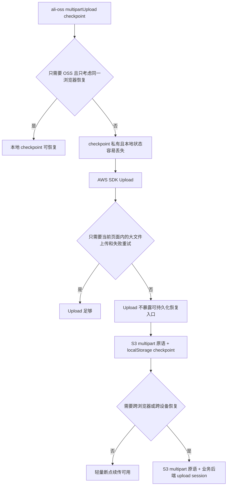
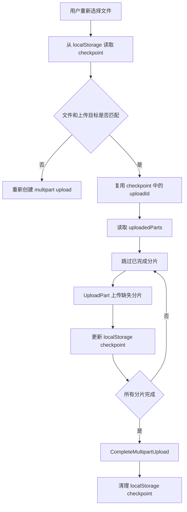
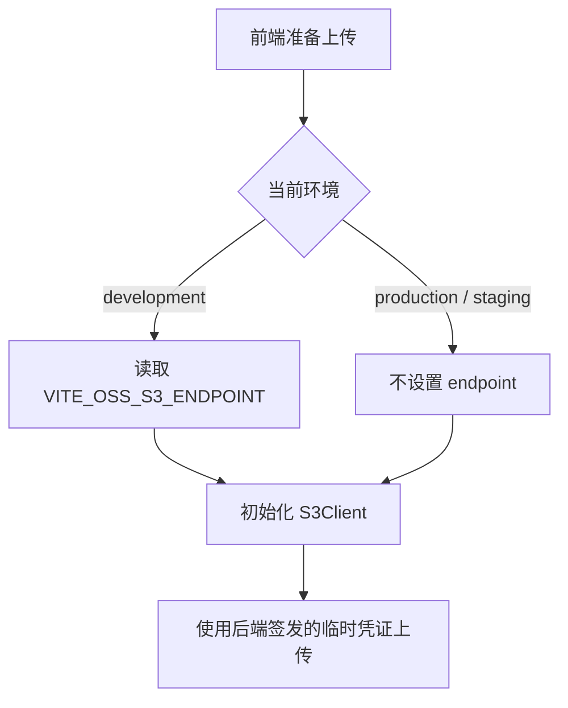
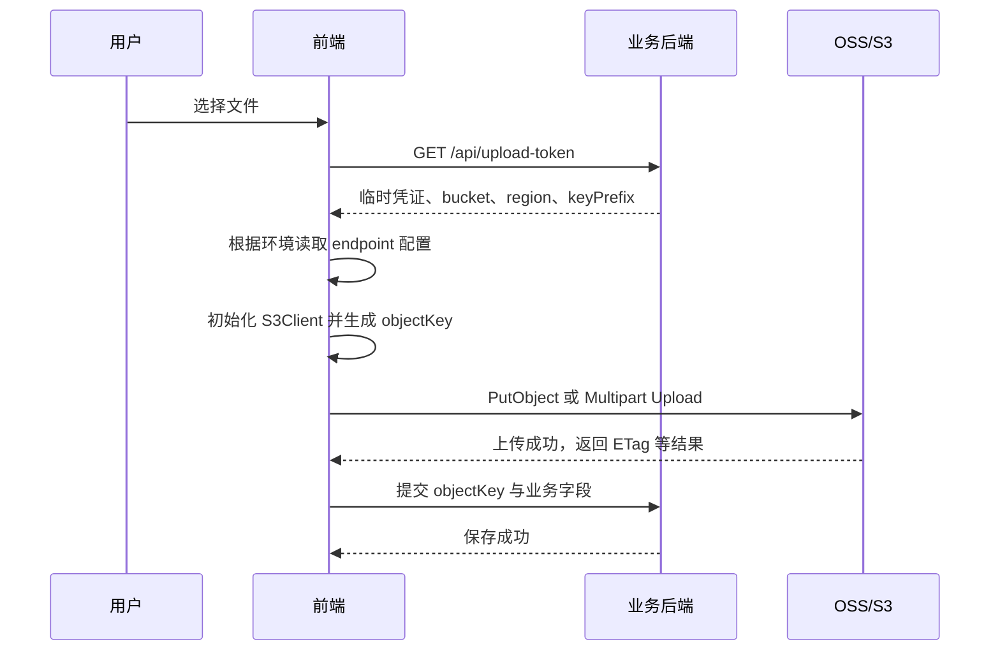
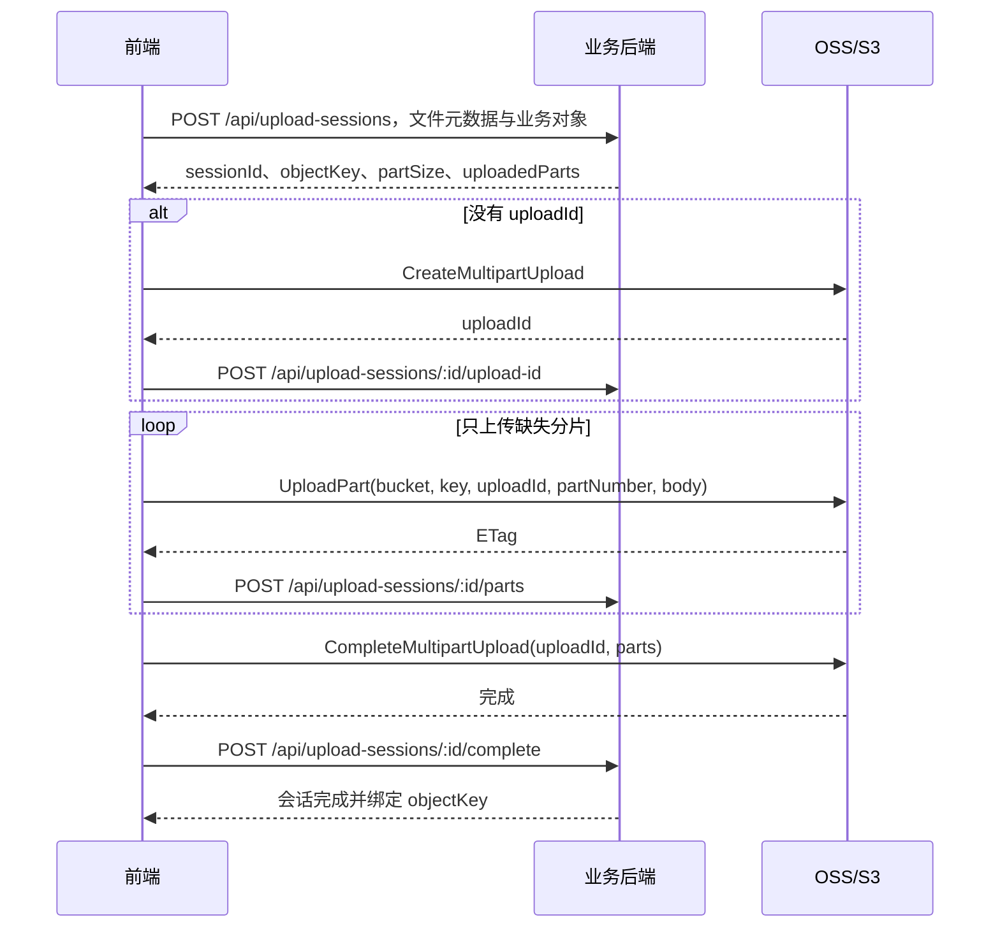
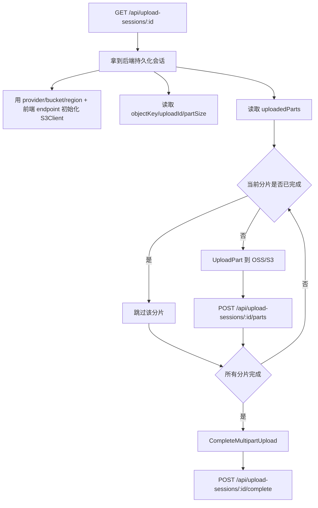

# OSS / AWS S3 前端直传方案

前端统一 AWS SDK v3，**开发环境通过 OSS S3-compatible endpoint 模拟 S3**。

## 一、背景

本方案讨论浏览器端文件直传对象存储的设计。目标是让文件数据直接从前端上传到对象存储，避免大文件经过业务后端转发，从而降低后端带宽、内存、请求超时和服务稳定性压力。

当前开发阶段使用阿里云 OSS 的 S3-compatible 接口模拟 AWS S3，后续生产环境可能切换到 AWS S3。为了避免前端维护两套上传实现，整体方向是统一使用 AWS SDK v3 和 S3-compatible multipart API，只通过运行环境、临时凭证和少量 provider 差异适配 OSS / S3。

上传能力需要分成两层看：

- 常规大文件上传：优先使用 `@aws-sdk/lib-storage Upload`，它已经封装了分片、并发、重试和进度事件
- 断点续传：如果要求页面刷新后跳过已上传分片，或进一步支持跨浏览器 / 跨设备恢复，就不能只依赖 `Upload`，需要基于 S3 multipart 原语保存 `uploadId` 和 `uploadedParts`

因此，本方案重点明确三件事：

- 前端直传的统一上传契约和运行时 endpoint 配置方式
- `Upload`、`ali-oss checkpoint`、localStorage checkpoint、后端持久化 upload session 的能力边界
- 最终可演进到 OSS / AWS S3 共用的断点续传模型

## 二、结论

### 主方案

前端统一使用 **AWS SDK v3 体系**，但要把“基础上传”和“跨会话断点续传”分开看：

- 常规上传：使用 `@aws-sdk/lib-storage` 作为默认实现
- 断点续传：基于 `@aws-sdk/client-s3` 的 multipart 原语自建恢复层，并由业务后端持久化上传会话与已完成分片

补充说明：

- 开发环境：后端签发 OSS 临时凭证；前端根据环境变量使用 OSS 的 S3-compatible `endpoint`
- 生产环境：后端签发 AWS STS / AssumeRole 凭证；前端不配置自定义 `endpoint`，使用 AWS SDK 默认 S3 endpoint 解析
- 前端上传主链路保持在 AWS SDK v3 体系内，只切换后端返回的 token / session 数据，以及前端本地环境配置里的 endpoint
- `@aws-sdk/lib-storage` 负责单次会话内的 multipart、并发、重试、进度事件，但不提供浏览器刷新后直接恢复同一 upload session 的开箱方案
- 如果断点续传设计只依赖 S3-compatible multipart 原语，可以同时覆盖 OSS 和 AWS S3
- 这不表示 OSS 与 S3 完全等价，也不支持把未完成 upload session 从 OSS 迁到 S3，或反向迁移

### 不作为主架构的方案

不建议把“开发用 `ali-oss`、生产用 `@aws-sdk/*`”作为主上传架构。

原因很简单：

- 两套 SDK 的 multipart、进度、URL、重试语义不完全一致
- 后端联调契约会被两套实现拉扯，后续更容易产生 drift
- OSS 官方文档已经**明确支持用 AWS SDK v3 访问 OSS**

### 断点续传方案对比

断点续传不是“SDK 会分片”这么简单。`partSize` 和 `queueSize` 解决的是单次上传过程里的切片大小和并发数；真正的断点续传还需要知道“这次 multipart upload 的 `uploadId` 是什么、哪些 `partNumber` 已经上传成功、每个分片对应的 `ETag` 是什么”。基于这个标准，可以把几个候选方案放在一起比较。



#### 1. `ali-oss` checkpoint：能续传，但强绑定 OSS SDK

`ali-oss` 的 `multipartUpload` 支持传入 `checkpoint`，也会在 `progress` 回调里持续吐出新的 checkpoint。前端把 checkpoint 存下来，下次重新上传同一个文件时再传回 SDK，SDK 就可以基于里面的 `uploadId` / 已完成分片信息跳过已上传部分。

典型实现思路如下：

```TypeScript
await client.multipartUpload(objectKey, file, {
  // 分片大小要和后续恢复时使用的策略保持一致。
  partSize: PART_SIZE,

  // 上一次未完成上传保存下来的 checkpoint。
  // ali-oss 会基于其中的 uploadId / 已完成分片信息跳过已上传部分。
  checkpoint: initialCheckpoint,

  progress: (p, nextCheckpoint) => {
    // 每次进度变化都持久化最新 checkpoint；
    // 生产级实现不应只放 localStorage，还需要回写业务后端。
    persistSession(nextCheckpoint)
  },
})
```

它的问题不在于“不能用”，而在于边界很窄：

- 如果 checkpoint 只存在 `localStorage`，用户清空浏览器缓存、换浏览器、换电脑后，前端 checkpoint 就彻底丢失
- 如果要做真正跨会话 / 跨设备恢复，业务后端同样要保存用户、业务对象、文件指纹、`objectKey`、checkpoint、状态和过期时间
- checkpoint 是 `ali-oss` SDK 的私有数据结构，不能直接交给 AWS SDK v3，也不适合作为 OSS / S3 统一断点续传协议
- 一旦生产环境切到 AWS S3，这套 checkpoint 恢复逻辑需要重新写

所以：如果项目确定只用 OSS，`ali-oss checkpoint + 后端持久化 checkpoint` 可以成立；但它不是本方案的主路线。

#### 2. `@aws-sdk/lib-storage Upload`：能分片上传，但不能直接断点续传

`Upload` 已经封装了大文件分片、`partSize` 阈值判断、`queueSize` 并发、进度事件和单次上传过程里的失败重试。因此常规大文件上传应该优先用它，代码少、行为稳定。

其中进度事件也是 `Upload` 的重要价值。业务层可以直接监听 `httpUploadProgress`，用 `loaded / total` 更新 UI：

```TypeScript
managedUpload.on('httpUploadProgress', (event) => {
  if (typeof event.loaded !== 'number') return

  const total = typeof event.total === 'number' && event.total > 0
    ? event.total
    : file.size
  const percent = Math.round((event.loaded / total) * 100)

  onProgress(percent)
})
```

但 `Upload` 的定位是“当前 JS 运行期间的 managed upload”，不是“可恢复的 upload session 管理器”。运行中虽然可以读到实例上的 `uploadId`，但它没有公开的恢复入参，不能把上一次的 `uploadId` / `uploadedParts` 传回新实例继续上传。因此它不提供下面这些恢复能力：

- 把当前 multipart 的 `uploadId` 和已完成 `partNumber + ETag` 作为稳定 checkpoint 管理
- 页面刷新后把已有 `uploadId` 塞回新的 `Upload` 实例继续传
- 根据后端保存的 uploaded parts 跳过已完成分片，只补传缺失分片

所以 `Upload` 适合：

- 普通大文件直传
- 当前页面不刷新时的上传中重试
- 不要求跨刷新 / 跨设备恢复的场景

但只要业务要求“刷新页面后继续同一次上传”或“换设备后继续上传”，就不能只靠 `Upload`。

外部依据：

- [`aws/aws-sdk-js-v3#3509`](https://github.com/aws/aws-sdk-js-v3/issues/3509)：社区曾明确请求给 `@aws-sdk/lib-storage Upload` 增加 breakpoint / resume 能力，希望能通过已有 `uploadId` 恢复上传；该 issue 最终因长期未活跃关闭，并没有形成官方 `resumeUpload` / `checkpoint` API
- [AWS S3 multipart upload 文档](https://docs.aws.amazon.com/AmazonS3/latest/userguide/mpu-upload-object.html)：AWS 官方把高层上传工具和低层 multipart API 分开描述；涉及暂停 / 恢复、列举已上传分片、完成或中止 multipart upload 时，需要回到 low-level multipart API
- [Implementing AWS S3 Multipart Uploads](https://medium.com/czi-technology/implementing-aws-s3-multipart-uploads-b8daa1809504)。他们原本基于 @aws-sdk/lib-storage Upload，但因为 Upload 不支持 paused/resumable uploads，最后 fork 了 AWS SDK，让 Upload 支持传入 upload ID，并查询已上传 parts 后只补传缺失部分。

#### 3. S3 multipart 原语 + localStorage checkpoint：可以刷新续传，但不跨设备

如果目标只是“同一浏览器刷新后，跳过已上传分片继续传”，可以先做轻量版断点续传：仍然使用 S3 multipart 原语，但 checkpoint 只放在 `localStorage`，不依赖业务后端持久化 upload session。

这个方案不能基于 `Upload` 实现，因为 `Upload` 没有 `checkpoint` / `uploadId` / `uploadedParts` 这类恢复入参。它必须自己调用 `CreateMultipartUpload`、`UploadPart` 和 `CompleteMultipartUpload`，只是把恢复状态保存在浏览器本地。

前端本地至少要保存：

```TypeScript
interface LocalMultipartCheckpoint {
  version: number
  fileId: string
  fileMeta: {
    name: string
    size: number
    lastModified: number
    type?: string
  }
  provider: 'oss' | 'aws'
  bucket: string
  region: string
  objectKey: string
  uploadId: string
  partSize: number
  uploadedParts: Array<{
    partNumber: number
    etag: string
    size: number
  }>
  updatedAt: number
}
```

恢复条件：

- 用户重新选择的是同一个文件，至少能匹配 `name + size + lastModified`
- `localStorage` 里的 checkpoint 没有被清掉
- 底层 multipart upload 仍然有效，`uploadId` 没有被对象存储生命周期清理
- 当前环境、`provider`、`bucket`、`region`、`objectKey` 与 checkpoint 一致

它的边界也很明确：

- 可以支持页面刷新后的跳过已上传分片
- 不能支持清空浏览器缓存后的恢复
- 不能支持换浏览器 / 换电脑后的恢复
- 无法作为跨设备、跨会话的唯一真相来源

因此它适合作为 demo、低风险业务或早期过渡方案；如果附件上传是关键业务能力，仍建议进入下一种后端持久化方案。



#### 4. S3 multipart 原语 + 业务后端 upload session：统一断点续传的最终方案

如果要同时覆盖 OSS S3-compatible endpoint 和 AWS S3，并且支持真正跨会话恢复，就需要回到 S3 multipart 原语：

- `CreateMultipartUpload`：创建上传会话，拿到 `uploadId`
- `UploadPart`：上传单个分片，拿到该分片的 `ETag`
- `ListParts`：必要时让后端与对象存储对账
- `CompleteMultipartUpload`：按 `partNumber + ETag` 完成合并
- `AbortMultipartUpload`：取消并清理未完成分片

这条路需要业务后端配合提供 upload session 接口。后端不负责转发文件内容，但要保存恢复所需的控制面状态：`sessionId`、`provider`、`bucket`、`region`、`objectKey`、`uploadId`、`partSize`、`uploadedParts[]`、`status`、`expiresAt`，并把上传会话和用户 / 业务对象绑定起来。

最终结论是：

- `ali-oss checkpoint` 是 OSS SDK 私有恢复能力，适合 OSS-only，且生产级使用仍需要后端持久化
- `Upload` 是常规大文件上传执行器，不是跨会话断点续传方案
- 同一浏览器刷新后跳过已上传分片，可以用 S3-compatible multipart 原语 + `localStorage` checkpoint 做轻量版
- 统一 OSS / AWS S3 且支持跨浏览器 / 跨设备恢复的断点续传，需要基于 S3-compatible multipart 原语自建恢复层，并由业务后端提供对应接口

## 三、落地建议

实际落地时，至少拆成下面几层：

```Plaintext
src/
├── upload/
│   ├── client.ts        # S3Client 初始化
│   ├── types.ts         # UploadTokenResponse / UploadSession 等类型
│   ├── upload.ts        # 常规上传封装
│   ├── multipart.ts     # multipart 原语封装
│   ├── resume.ts        # 断点续传恢复逻辑
│   └── policy.ts        # 可选：POST Policy 相关逻辑
├── hooks/
│   └── useUpload.ts     # 业务层 Hook
└── components/
    └── Uploader.tsx     # 上传组件
```

### 上传管理层

前端建议沉淀一个上传管理层，而不是让页面组件直接感知所有 S3 multipart 细节。这个管理层可以是 class，也可以是一组函数 / Hook，但职责边界要稳定：

- 初始化 `S3Client`，屏蔽环境 endpoint、临时凭证和 provider 差异
- 封装常规上传：小文件 `PutObject` 或 `@aws-sdk/lib-storage Upload`
- 封装断点续传：基于 `CreateMultipartUpload` / `UploadPart` / `CompleteMultipartUpload` 自建恢复层
- 封装取消上传：multipart 走 `AbortMultipartUpload`，同时通知业务后端标记会话状态
- 对上层组件暴露统一结果：`key`、进度、状态、错误、取消 / 重试入口

### 事件与回调

上传层需要把关键控制点暴露给业务层，尤其是断点续传场景。推荐至少提供下面这些事件或回调：

```TypeScript
interface UploadCallbacks {
  onUploadIdCreated?: (data: {
    sessionId: string
    uploadId: string
    objectKey: string
  }) => void | Promise<void>
  onPartUploaded?: (data: {
    sessionId: string
    partNumber: number
    etag: string
    size: number
  }) => void | Promise<void>
  onProgress?: (percent: number) => void
  onComplete?: (data: { key: string }) => void
  onError?: (error: unknown) => void
}
```

`onUploadIdCreated` 和 `onPartUploaded` 最关键：它们对应后端持久化 `uploadId` 与 `uploadedParts[]` 的时机。如果这两个状态只留在前端内存里，刷新页面后就无法恢复。

如果上传管理层设计成框架无关的 class，可以借鉴 `EventEmitter3` 做事件分发；如果只服务 React Hook，直接用 callback 参数或内部状态通常更简单。这里借鉴的是事件模型，不强制引入 `EventEmitter3`。

### 并发工具

自建 multipart 恢复层时，需要自己控制 `UploadPart` 的并发。可以借鉴 `p-limit`：

```TypeScript
import pLimit from 'p-limit'

const limit = pLimit(4)

await Promise.all(
  missingParts.map((part) =>
    limit(async () => {
      const result = await uploadPart(part)
      await saveUploadedPart(result)
      return result
    })
  )
)
```

`p-limit` 的价值是让并发控制足够小而清晰，适合替代手写队列。注意：并发上传成功后，每个分片的 `partNumber / etag / size` 仍然要立即回写业务后端。`@aws-sdk/lib-storage Upload` 已经内置 `queueSize`，常规上传不需要再叠 `p-limit`。

## 四、为什么选“统一 AWS SDK v3 + OSS 兼容 endpoint”

1. **开发和生产的语义更一致**

    同一套 AWS SDK v3 体系，开发时切 OSS endpoint，生产时切 AWS 默认 endpoint。

2. **更适合和公司后端对接**

    公司后端未来大概率会给出 AWS STS / S3 风格的临时凭证，前端无需重写上传主链路。

3. **OSS 官方支持这条路**

    OSS 提供 S3 兼容接口，AWS SDK v3 可直接通过 `endpoint` + 临时凭证访问 OSS。

4. **避免双 SDK 漂移**

    双 SDK 方案会在 multipart、重试、URL 处理、resume 等行为上逐渐分叉，维护成本高。

5. **更容易做统一断点续传设计**

    只要续传方案建立在 S3-compatible multipart 原语之上，OSS dev 与 S3 prod 就可以共用同一套前端协议和后端会话模型。

6. **降低后续切换对象存储的成本**

    这里选择 S3-compatible 协议，不是为了绑定 AWS，而是为了把 OSS、S3，以及未来可能接入的其他兼容对象存储收敛到同一套上传语义里。后续切换厂商时，优先调整凭证签发、region、bucket、endpoint 和少量 provider 差异，而不是重写业务上传流程。

## 五、统一上传契约

建议把新方案的后端返回值定义成“上传令牌”，而不是让前端感知具体云厂商细节。

```TypeScript
export interface UploadTokenResponse {
  provider: 'oss' | 'aws'
  accessKeyId: string
  secretAccessKey: string
  sessionToken: string
  expiration: string
  bucket: string
  region: string
  keyPrefix?: string
  publicBaseUrl?: string
  objectUrl?: string
}
```

### 约束说明

- `region` 必须是统一后的 region 标识，不要把 `oss-cn-*` 和 `cn-*` 混着当同一个值用
- OSS 侧可以在后端内部继续保留 `OSS_REGION` 之类的 env 命名，但返回给前端前要做归一化
- `endpoint` 不再由接口返回，统一放在前端环境配置中；开发环境配置 OSS S3-compatible endpoint，生产环境留空
- 前端环境里的 `endpoint` 必须与后端签发凭证对应的 `provider` / `bucket` / `region` 匹配，否则会出现签名不匹配或跨域失败
- `keyPrefix` 用于约束前端可写入的对象路径，避免前端无限制写任意目录
- `publicBaseUrl` 只用于公开读对象的展示地址前缀，不要让前端自己猜最终 URL
- `objectUrl` 只在后端已经确定最终访问地址时返回；如果对象走签名下载、CDN 或私有桶，应优先由后端直接给出
- `UploadTokenResponse` 只描述当前直传目标与临时凭证；断点续传的 session / uploadedParts 不建议混在这个 DTO 里，而应通过独立 session API 获取

### 前端 endpoint 配置

`endpoint` 属于运行环境配置，不属于业务接口契约。这样后端只负责签发临时凭证和业务约束，前端根据构建环境选择上传目标。

```TypeScript
interface UploadRuntimeConfig {
  provider: 'oss' | 'aws'
  endpoint?: string
}

export function getUploadRuntimeConfig(): UploadRuntimeConfig {
  if (import.meta.env.VITE_APP_ENV === 'development') {
    return {
      provider: 'oss',
      endpoint: import.meta.env.VITE_OSS_S3_ENDPOINT,
    }
  }

  return {
    provider: 'aws',
  }
}
```



## 六、上传流程

1. 前端选择文件
2. 请求后端 `GET /api/upload-token`
3. 后端返回临时凭证、region、bucket、可选 keyPrefix / publicBaseUrl / objectUrl
4. 前端读取本地环境配置，决定是否给 `S3Client` 设置 `endpoint`
5. 前端初始化 `S3Client`
6. 根据后端约定生成 `objectKey`（优先使用后端返回的 `keyPrefix` 约束路径）
7. 调用 `Upload` 执行上传（小文件简单上传，大文件 multipart）
8. 监听进度更新 UI
9. 上传完成后，前端把 `key` 提交给业务后端保存



### 为什么保存 key，而不是文件 URL

`docs/前端直传云端最佳实践1.md` 里写“将 URL 发送给后端业务接口”，是一个偏简化的说法；它想表达的是“上传完成后，把云端对象标识提交给业务后端”。在当前方案里，建议业务库优先保存 `objectKey`，原因是：

- `objectKey` 是对象在 bucket 内的稳定身份；URL 是访问方式，可能因为 CDN、自定义域名、私有桶、签名下载、跨环境域名变更而变化
- 公开 URL 可以由 `publicBaseUrl + objectKey` 派生，私有文件则应该由后端生成临时签名 URL；这些都不适合把某一次 URL 永久写死进业务表
- 如果 URL 是 signed URL，把它保存到业务库既容易过期，也可能把临时访问凭证残留在数据里
- 后端保存 `key` 后，可以在读取业务数据时按当前环境、权限和访问策略返回 `objectUrl`、签名下载地址或 CDN 地址

因此推荐的业务提交 payload 是 `objectKey` / `key` 加必要的文件元数据；只有在明确是公开读、且后端已经确认最终访问域名不会变化时，才把 URL 作为冗余展示字段保存。

### 前端示意

```TypeScript
import { S3Client } from '@aws-sdk/client-s3'
import { Upload } from '@aws-sdk/lib-storage'

const token = await fetch('/api/upload-token').then(r => r.json())
const runtimeConfig = getUploadRuntimeConfig()

if (token.provider !== runtimeConfig.provider) {
  throw new Error(`上传环境不匹配：token=${token.provider}, runtime=${runtimeConfig.provider}`)
}

const client = new S3Client({
  region: token.region,
  ...(runtimeConfig.endpoint ? { endpoint: runtimeConfig.endpoint } : {}),
  credentials: {
    accessKeyId: token.accessKeyId,
    secretAccessKey: token.secretAccessKey,
    sessionToken: token.sessionToken,
  },
})

const objectKey = `${token.keyPrefix ?? 'uploads/'}${file.name}`

const upload = new Upload({
  client,
  params: {
    Bucket: token.bucket,
    Key: objectKey,
    Body: file,
    ContentType: file.type || 'application/octet-stream',
  },
  // Upload 按 partSize 切块；如果最终只有一个块，会走 PutObject 简单上传。
  // 超过 partSize 后会产生多个块，自动走 multipart upload。
  partSize: 10 * 1024 * 1024,
  // 分片并发数：仅 multipart 时生效；失败重试依赖 S3Client retry 策略
  // 跨刷新或跨设备续传需要单独的 upload session 持久化与恢复逻辑
  queueSize: 4,
})
```

### 为什么 `Upload` 还不够

- `@aws-sdk/lib-storage` 更像是“当前页面会话里的 multipart 执行器”，不是跨会话恢复管理器
- 它能处理上传过程中的失败重试，但不会替你持久化 `uploadId` 和已完成分片
- 它能通过 `httpUploadProgress` 提供文件级进度；如果改用 multipart 原语自建断点续传，进度汇总也要由上传管理层自己维护
- 因此“失败重试”和“刷新页面 / 清空缓存 / 换设备后的断点续传”是两件不同的事

### 后端持久化断点续传主流程

1. 前端先把文件元数据（文件名、size、`lastModified`、可选 hash）发给业务后端，调用 `POST /api/upload-sessions`
2. 后端按“用户 + 业务对象 + 文件指纹”创建或查找未完成会话，并返回 `sessionId`、`objectKey`、`partSize`、已完成分片列表，以及当前 provider 所需的上传目标信息
3. 如果该会话还没有 `uploadId`，有两种实现方式，二选一即可，但不要混用：
   - 前端拿临时凭证调用 `CreateMultipartUpload`，再把 `uploadId` 回写业务后端
   - 后端直接创建 multipart upload，并把 `uploadId` 返回给前端
4. 前端按 `partSize` 切片，跳过后端已记录完成的 `partNumber`，只补传缺失分片
5. 每个分片上传成功后，前端把 `partNumber`、`etag`、`size` 回写到 `POST /api/upload-sessions/:id/parts`
6. 恢复上传时，前端以业务后端记录为准；如有必要，后端可再调用 `ListParts` 与对象存储做一次对账
7. 全部分片完成后，前端或后端调用 `CompleteMultipartUpload`，再把会话标记为 completed



### 后端持久化断点续传前端示意

断点续传不要和上面的 `Upload` 示例硬塞进同一个代码块里。上面的示例适合“当前页面会话内的常规上传”；下面这段示意的是“跨刷新 / 跨设备恢复”的控制流，需要直接使用 S3-compatible multipart 原语。示例中的 `fetchJson` / `postJson` 代表项目内常规的接口请求封装。

```TypeScript
import {
  CompleteMultipartUploadCommand,
  CreateMultipartUploadCommand,
  S3Client,
  UploadPartCommand,
} from '@aws-sdk/client-s3'

interface UploadedPart {
  partNumber: number
  etag: string
  size: number
}

interface UploadSession {
  sessionId: string
  provider: 'oss' | 'aws'
  bucket: string
  region: string
  objectKey: string
  uploadId?: string
  partSize: number
  uploadedParts: UploadedPart[]
}

interface UploadToken {
  provider: 'oss' | 'aws'
  accessKeyId: string
  secretAccessKey: string
  sessionToken: string
  bucket: string
  region: string
}

async function resumeMultipartUpload(
  file: File,
  businessId: string,
  onProgress?: (percent: number) => void
) {
  const session = await postJson<UploadSession>('/api/upload-sessions', {
    businessId,
    fileName: file.name,
    fileSize: file.size,
    lastModified: file.lastModified,
    contentType: file.type || 'application/octet-stream',
  })
  const token = await fetchJson<UploadToken>('/api/upload-token')
  const runtimeConfig = getUploadRuntimeConfig()

  if (
    session.provider !== token.provider ||
    token.provider !== runtimeConfig.provider ||
    session.bucket !== token.bucket ||
    session.region !== token.region
  ) {
    throw new Error('上传会话、凭证和前端运行环境不匹配')
  }

  const client = new S3Client({
    region: token.region,
    ...(runtimeConfig.endpoint ? { endpoint: runtimeConfig.endpoint } : {}),
    credentials: {
      accessKeyId: token.accessKeyId,
      secretAccessKey: token.secretAccessKey,
      sessionToken: token.sessionToken,
    },
  })

  let uploadId = session.uploadId
  if (!uploadId) {
    // 第一次上传该文件时创建 multipart upload，并拿到后续恢复必须依赖的 uploadId。
    const created = await client.send(new CreateMultipartUploadCommand({
      Bucket: session.bucket,
      Key: session.objectKey,
      ContentType: file.type || 'application/octet-stream',
    }))

    if (!created.UploadId) {
      throw new Error('CreateMultipartUpload 未返回 uploadId')
    }

    uploadId = created.UploadId
    // uploadId 必须回写业务后端；只存在浏览器内存里就无法跨刷新恢复。
    await postJson(`/api/upload-sessions/${session.sessionId}/upload-id`, { uploadId })
  }

  // 后端返回的 uploadedParts 是恢复上传的真相来源，用它跳过已经成功的分片。
  const completedParts = new Map<number, UploadedPart>(
    session.uploadedParts.map((part) => [part.partNumber, part])
  )
  const totalParts = Math.ceil(file.size / session.partSize)
  let uploadedBytes = [...completedParts.values()].reduce((sum, part) => sum + part.size, 0)

  for (let partNumber = 1; partNumber <= totalParts; partNumber += 1) {
    if (completedParts.has(partNumber)) {
      continue
    }

    const start = (partNumber - 1) * session.partSize
    const end = Math.min(start + session.partSize, file.size)
    const body = file.slice(start, end)

    // 只上传缺失分片；每个分片成功后，S3/OSS 会返回完成合并所需的 ETag。
    const uploaded = await client.send(new UploadPartCommand({
      Bucket: session.bucket,
      Key: session.objectKey,
      UploadId: uploadId,
      PartNumber: partNumber,
      Body: body,
    }))

    if (!uploaded.ETag) {
      throw new Error(`第 ${partNumber} 个分片未返回 ETag`)
    }

    const part = {
      partNumber,
      etag: uploaded.ETag,
      size: body.size,
    }

    // 分片结果要立刻回写后端，避免刷新页面后丢失进度。
    await postJson(`/api/upload-sessions/${session.sessionId}/parts`, part)
    completedParts.set(partNumber, part)
    uploadedBytes += body.size
    onProgress?.(Math.round((uploadedBytes / file.size) * 100))
  }

  const parts = [...completedParts.values()]
    .sort((a, b) => a.partNumber - b.partNumber)
    .map((part) => ({
      PartNumber: part.partNumber,
      ETag: part.etag,
    }))

  // CompleteMultipartUpload 必须提交完整且按 partNumber 排序的 Parts 列表。
  await client.send(new CompleteMultipartUploadCommand({
    Bucket: session.bucket,
    Key: session.objectKey,
    UploadId: uploadId,
    MultipartUpload: { Parts: parts },
  }))

  await postJson(`/api/upload-sessions/${session.sessionId}/complete`, {
    objectKey: session.objectKey,
    parts,
  })

  return {
    key: session.objectKey,
  }
}
```

这段示例为了突出协议关系，先按串行分片写；真实实现可以在 `UploadPartCommand` 外层加并发池，但并发成功后的 `partNumber / etag / size` 仍然要逐个回写业务后端。

注意：不用 `Upload` 后，进度也要自己维护。上面的示例采用的是“分片完成后更新”的简化算法：`uploadedBytes = 已完成分片总字节数`，`percent = uploadedBytes / file.size`。这种方式稳定但会按分片跳进度；如果需要更细腻的实时进度，需要额外跟踪每个正在上传分片的 loaded bytes，再汇总为文件级进度。

如果采用 localStorage-only checkpoint，核心上传代码仍然是这套 multipart 原语；区别只是把 `POST /api/upload-sessions/:id/upload-id` 和 `POST /api/upload-sessions/:id/parts` 这两个持久化点换成本地 `localStorage` 写入。能力边界也随之降低为“同一浏览器、缓存未清理”的恢复。

> 浏览器本地缓存可以作为加速优化，但不能作为唯一真相来源。用户清空浏览器缓存、换浏览器、换电脑后，本地状态会直接丢失；只有业务后端保存的 upload session / uploaded parts 才能支撑真正的断点续传。

## 七、后端联调契约

至少要跟后端提前约定下面几件事：

### 凭证格式

- 返回稳定 DTO
- 字段名固定，建议统一使用 `accessKeyId` / `secretAccessKey` / `sessionToken` / `expiration`
- `region` 必须由后端显式返回，并与当前 Bucket 完全匹配
- `endpoint` 不从接口获取，前端只从环境配置读取；接口返回的 `provider` / `bucket` / `region` 要能和该环境配置对齐
- 不在前端暴露长期 AccessKey / SecretKey

### 对象 key 归属

二选一即可，不要混用：

- 后端直接返回完整 `objectKey`
- 后端返回 `keyPrefix`，前端只在这个前缀下拼接文件名

### 可访问性

- 如果对象是公开读，后端应返回 `publicBaseUrl`
- 如果后端已经能确定最终访问地址，可以直接返回 `objectUrl`
- 如果对象是私有读，前端不要自己拼“可访问 URL”，应走后端签名下载 / 预览接口

### CORS

Bucket 必须允许浏览器直传所需的 origin 和方法，尤其是 multipart 上传所需的 `PUT` / `POST` / `HEAD` 等。

浏览器侧还必须能读取上传响应里的关键 header：`UploadPart` 成功后需要拿到 `ETag`，后续 `CompleteMultipartUpload` 要提交完整的 `partNumber + ETag` 列表。因此 CORS 的 `ExposeHeaders` 至少要包含 `ETag`；如果启用了 checksum，还要同时暴露对应的 checksum header。

### TTL / 刷新

- 上传 token 必须有明确过期时间
- token TTL 要覆盖预期上传时长，或后端提供刷新机制
- 前端不要假设页面刷新后还能自动续上同一次上传
- 上传 token TTL 与 multipart upload session TTL 是两件事，不要混为一谈
- 只要底层 `uploadId` 仍有效，后端就可以重新签发临时凭证，让前端继续同一次 multipart upload

### 取消与清理

取消上传要分场景处理：

- multipart 上传：前端调用 `AbortMultipartUpload` 清理对象存储里的未完成分片，同时调用 `POST /api/upload-sessions/:id/abort` 把业务会话标记为 aborted
- 常规小文件上传：可以用 `AbortController` 尝试取消当前请求，但文件可能已经很快上传完成；如果业务要求统一“取消”体验，应在上传成功回调后按业务状态决定是否删除对象或丢弃业务绑定
- 页面关闭 / 网络中断：前端不一定有机会主动 abort，因此后端需要定期回收过期的未完成 upload session，并调用对象存储的 abort 能力清理孤儿分片

```TypeScript
import { AbortMultipartUploadCommand, S3Client } from '@aws-sdk/client-s3'

async function abortMultipartSession(client: S3Client, session: UploadSession) {
  if (!session.uploadId) return

  await client.send(new AbortMultipartUploadCommand({
    Bucket: session.bucket,
    Key: session.objectKey,
    UploadId: session.uploadId,
  }))

  await postJson(`/api/upload-sessions/${session.sessionId}/abort`, {
    uploadId: session.uploadId,
  })
}
```

### 断点续传与进度持久化

仅把分片进度放在浏览器里是不够的。用户清空浏览器缓存、关闭页面、换浏览器，甚至换一台电脑后，本地 checkpoint 都会彻底丢失；而 multipart upload 的 `uploadId`、已完成分片列表和上传目标信息，必须有一个跨设备、跨会话的持久化来源，这个来源只能是业务后端。

业务后端至少要保存：

- `sessionId`、`provider`、`bucket`、`region`
- `objectKey`、`uploadId`、`partSize`
- `fileName`、`fileSize`、可选 `fileHash`
- `uploadedParts[]`（至少包含 `partNumber`、`etag`、`size`、`uploadedAt`）
- `status`、`expiresAt`

除此之外，业务后端还要负责：

- 把上传会话和用户 / 业务实体绑定，做权限校验
- 在恢复上传时提供统一的进度真相来源
- 回收长期未完成的 multipart 会话，避免对象存储里留下孤儿分片
- 在上传完成后把对象 key 与业务记录绑定

### 断点续传接口建议

- `POST /api/upload-sessions`：创建或查找上传会话
- `POST /api/upload-sessions/:id/upload-id`：登记新建的 `uploadId`（仅当前端负责调用 `CreateMultipartUpload` 时需要）
- `GET /api/upload-sessions/:id`：查询上传会话、上传目标和已完成分片
- `POST /api/upload-sessions/:id/parts`：登记单个分片上传成功的结果
- `POST /api/upload-sessions/:id/complete`：完成上传并写入业务记录
- `POST /api/upload-sessions/:id/abort`：终止上传并清理会话

### `GET /api/upload-sessions/:id` 的处理方式

这个接口返回的是“上传会话状态”，不是要原样传给 S3 的 payload。前端拿到后，应把它拆成三类信息使用：

- 初始化客户端：使用接口里的 `provider` / `bucket` / `region`，再叠加前端环境配置里的 `endpoint` 初始化 `S3Client`
- 恢复上传：使用 `objectKey`、`uploadId`、`partSize` 和 `uploadedParts` 判断哪些分片已经完成，只补传缺失分片
- 完成上传：把 `uploadedParts` 中的 `partNumber` / `etag` 组装成 `CompleteMultipartUpload` 需要的 `Parts` 列表

真正发给 S3/OSS 的只是 multipart 原语所需字段，例如 `Bucket`、`Key`、`UploadId`、`PartNumber`、分片 `Body`，以及完成时的 `Parts` 列表；`sessionId`、业务对象 ID、用户 ID、`status`、`expiresAt` 这些只属于业务后端。

```TypeScript
interface UploadSessionResponse {
  sessionId: string
  provider: 'oss' | 'aws'
  bucket: string
  region: string
  objectKey: string
  uploadId: string
  partSize: number
  uploadedParts: Array<{
    partNumber: number
    etag: string
    size: number
  }>
  status: 'uploading' | 'completed' | 'aborted' | 'expired'
  expiresAt: string
}
```



如果采用 `ali-oss` checkpoint，本质上保存的是 OSS SDK 私有恢复状态。它适合同一浏览器里的快速恢复，但不能直接传给 S3，也不能支撑清缓存、换浏览器、换设备后的恢复。统一方案应把 SDK 私有 checkpoint 拆成跨 SDK 的通用会话模型：`uploadId` + `uploadedParts[]` + `objectKey` + `partSize`，由业务后端作为真相来源。

### OSS 兼容 S3 的边界与注意事项

OSS 可以看作 **S3 兼容子集**，前端直传主链路可用，但不是和 Amazon S3 完全等价。边界如下：

|差异点|说明|
|---|---|
|请求风格|通过 AWS SDK 访问 OSS S3-compatible endpoint 时，主路径建议使用 `Virtual Hosted` 风格；阿里云文档也提到 OSS 存在 path-style，但不同 endpoint、签名和 bucket 命名规则下兼容性更容易踩坑，不建议把 `forcePathStyle: true` 作为默认方案。|
|Endpoint / Region / 域名|OSS S3-compatible endpoint 建议使用 `https://s3.oss-{region}.aliyuncs.com`，不是 `https://s3.{region}.aliyuncs.com`；`region`、`endpoint`、最终公网访问域名不是同一件事，前端环境配置必须与后端签发凭证匹配，最终访问 URL 不要由前端盲拼。|
|认证体系|前端不能混用 AWS 和 OSS 的长期密钥；浏览器场景应由后端签发临时凭证，OSS STS 的 `securityToken` 映射到 AWS SDK v3 的 `sessionToken`。|
|ETag|完成 multipart 时必须保存并提交每个分片的 ETag；但 OSS 与 S3 的 ETag 规则不完全一致，不要把 multipart ETag 当作跨云一致的 MD5、去重或完整性校验值。|
|断点续传实现|如果续传方案建立在 `CreateMultipartUpload` / `UploadPart` / `ListParts` / `CompleteMultipartUpload` 这一层，两边都可支持；如果依赖某个 SDK 私有 checkpoint 或 provider-specific 扩展，就不能保证可移植。未完成 multipart upload 也只能在同一 `provider` / `bucket` / `objectKey` / `uploadId` 上恢复，不能跨 OSS/S3 迁移或切桶恢复。|

> 结论：如果只做前端直传上传，`PutObject` / multipart 这条主链路是可用的；如果把断点续传实现限定在 S3-compatible multipart 原语，并让业务后端持久化 `uploadId` 与 `uploadedParts`，则同一套前端设计可以覆盖 OSS 与 S3。超出这条主链路的对象处理、ACL、存储类型、Archive 恢复等能力，仍应视为 provider-specific 差异，不作为本方案的统一能力承诺。

## 八、参考依据

- [AWS SDK v3 `@aws-sdk/lib-storage` README](https://github.com/aws/aws-sdk-js-v3/tree/main/lib/lib-storage)
- [AWS S3 multipart upload 概览](https://docs.aws.amazon.com/AmazonS3/latest/userguide/mpuoverview.html)
- [AWS S3 `CompleteMultipartUpload` API](https://docs.aws.amazon.com/AmazonS3/latest/API/API_CompleteMultipartUpload.html)
- [AWS SDK for JavaScript v3 CORS 说明](https://docs.aws.amazon.com/sdk-for-javascript/v3/developer-guide/cors.html)
- [Alibaba Cloud OSS：Access OSS using an AWS SDK](https://www.alibabacloud.com/help/en/oss/developer-reference/use-aws-sdks-to-access-oss)
- [Alibaba Cloud OSS Browser.js：Resumable upload](https://www.alibabacloud.com/help/en/oss/developer-reference/resumable-upload-9)
